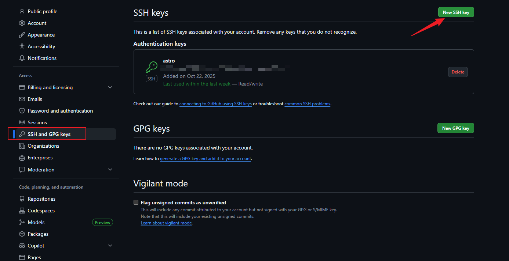
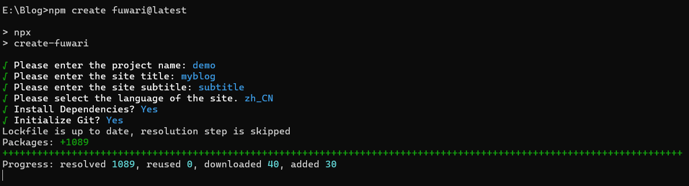
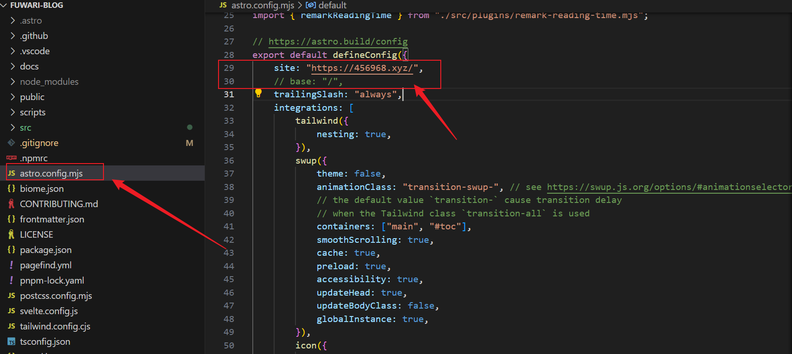
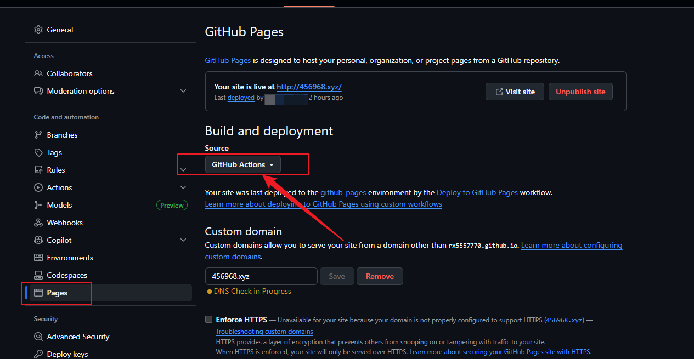

    
## 前言

通过GitHub Pages + Astro 部署的静态博客**无需自备服务器+域名**，将本地文件与互联网相通。类似的项目还有很多。

本文用到的[项目地址](https://github.com/saicaca/fuwari)
## 建站前的准备

1. GitHub账号
2. nodejs
3. git

## 进入教程

### git 配置

```shell
# 本地生成ssh公钥
ssh-keygen -t rsa -b 4096 -C "email@example.com"
```

生成公钥后去C盘的.ssh文件夹下找到 .rsa 文件，复制里面的内容。

### GitHub添加仓库

添加一个仓库然后设置名称为 `github用户名.github.io`，用户名填自己的。这个就是域名。


在用户设置中，如下粘贴刚刚的公钥。



---

### 安装

```shell
npm create fuwari@latest
```



### 配置

有两种配置：

- 没有自己的域名：
  找到 astro.config.mjs 配置 base 和 site，site设置为刚刚的域名。
- 有自己的域名：如下图配置



文章路径在 `src/content/posts/` 
左侧边栏以及头部信息路径在 `src/config.ts`
修改后，通过 `npm run dev` 即可启动。


### 通过git命令对接GitHub仓库

电脑 cd 到项目目录，然后通过git命令上传到建立的仓库。

```shell
# 验证
ssh -T git@github.com

# 设置信息
git config --global user.email "example@gmail.com"
git config --global user.name "example"
git init


git add .
git commit -m "Initial commit"
git branch -M main
git remote add origin <远程仓库URL>
git push -u origin main
```

上传后点设置，配置Action


> [!TIP]
> 也可以填写自己的自定义域名，不过我也不清楚为什么这里一直黄色。（虽然自定义域名也能用emmm），如果你有自定义于域名，那么可以通过CNAME解析到username.github.io做解析。



## 后续维护

我是通过obsidian来编写项目的markdown文件，然后通过 `git push` 来更新文章的。

当写好一篇文章后，到目录下运行

```shell
git add .
git commit -m "update post"
git push
```

#### md文章复制到博客

这可是件麻烦事，因为还要排版，主题的规定是在 `posts` 目录下用类似于 `post-1` 这种排版会更整齐。我的md文件则是有的在根目录下，有的在文件夹下（在文件夹下还会有assets存放图片），于是我便想到用python写个脚本帮我解决。


> [!TIP] 
> 原理：先获取文件夹下的内容，如果是md文件则复制到脚本自动创建的为 `post-1` 类似目录下，以及图片也会复制到新目录（不会影响源文件），不过要手动添加模板数据以供网站识别。

可根据脚本生成的 `posts_index.txt` 文件自定义设置数字，以便后续生成。

```python
import pa
thlib  
import re  
from pathlib import Path  
from datetime import datetime  
import shutil  
  
original_dir = Path(r"原始目录")  
outPut_Dir = original_dir / 'output'  
posts_config = original_dir / 'posts_index.txt'  
  
def convert_markdown_images(text):  
    """  
    将  格式的图片转换为标准的  格式  
  
    参数:  
        text: 包含特殊图片语法的Markdown文本  
  
    返回:  
        转换后的标准Markdown文本  
    """    # 使用正则表达式匹配  格式  
    pattern = r'!\[\[(.*?)\]\]'  
  
    # 替换为标准的  格式  
    def replacement(match):  
        image_path = match.group(1)  
        return f''  
  
    return re.sub(pattern, replacement, text)  
  
def add_template(f: Path):  
    default_title = f.stem  
    default_description = "''"  
    default_image = "''"  
    default_tags = []  
    default_category = '代码日常'  
  
    # 扫描目录下的md文件，并添加模板  
    print(f"当前文件:{f.name}")  
  
    # 获取文件创建日期  
    create_time = datetime.fromtimestamp(f.stat().st_ctime)  
    create_date = create_time.strftime("%Y-%m-%d")  
  
    title = input('请输入文章标题:')  
    description = input('请输入文章介绍:')  
    image = input('请输入图片地址:')  
    tags = input('请输入Tag标签(以,分割):')  
    category = input('请输入分类:')  
  
    if not title:  
        title = default_title  
  
    if not description:  
        description = default_description  
  
    if not image:  
        # image = "''"  
        image = default_image  
  
    if tags:  
        tags = tags.split(',')  
    else:  
        tags = default_tags  
    if not category:  
        category = default_category  
  
    original_content = f.read_text(encoding='utf-8')  
    template = \  
f"""  
---  
title: {title}  
published: {create_date}  
description: {description}  
image: {image}  
tags: {tags}  
category: {category}  
draft: false  
lang: zh-CN  
---  
    """    cover_content = convert_markdown_images(original_content)  
    new_content = template + cover_content  
    f.write_text(new_content,encoding='utf-8')  
    print(f"{f.name} 成功添加模板！")  
  
def run(original_dir: Path, output_dir: Path, prefix=''):  
  
    # 定义需要跳过的系统/隐藏文件夹名称（不区分大小写）  
    # 注意：Windows 下隐藏文件夹可能需要更复杂的检查  
    SKIP_FOLDERS = [  
        '$recycle.bin',  
        'system volume information',  
        'program files',  
        'windows',  
        'msocache',  
        '.pnpm-store'  # 你的 pnpm 存储目录  
    ]  
  
    # # 如果存在输出文件夹，则删除  
    # if output_dir.exists():  
    #     shutil.rmtree(output_dir)  
    # 读取文章索引，用于后续文章排序  
    if not posts_config.exists():  
        posts_config.touch()  
        posts_config.write_text('0')  
  
    post_index = int(posts_config.read_text(encoding='utf-8'))  
    print('开始运行')  
    for f in original_dir.iterdir():  
        # 跳过系统文件  
        if f.name.lower() in SKIP_FOLDERS:  
            continue  
  
        if f.name == 'posts_index.txt' or f == outPut_Dir:  
            continue  
  
        # 写入文件 记录文章名  
        post_index += 1  
        posts_config.write_text(str(post_index))  
        print(f'序号:{post_index} 文件路径: {f.absolute()}')  
  
        # 创建输出文件夹以指定格式  
        post_dir = output_dir / f'{prefix}-{post_index}'  
        post_dir.mkdir(parents=True, exist_ok=True)  
  
        # 进入分支判断是否是文件夹  
        if f.is_dir():  
            # 复制图片元素到输出文件夹  
            source_img_dir = f / 'assets'  
            target_img_dir = post_dir / 'assets'  
  
            # 目标路径存在 assets 则删除重新复制  
            if target_img_dir.exists():  
                shutil.rmtree(target_img_dir)  
  
            if source_img_dir.exists():  
                shutil.copytree(source_img_dir, target_img_dir)  
            else:  
                print(f"资源目录不存在: {source_img_dir}")  
  
  
  
            # 筛选文件  
            datas = list(f.glob('*.md')) + list(f.glob('*.markdown'))  
            for data in datas:  
                # 先复制，再处理副本  
                file = post_dir / data.name  
                shutil.copy(data, file)  
                add_template(file)  # 处理副本，保留原文件  
        # 单文件格式  
        elif f.is_file() and f.suffix in ('.md', '.markdown'):  
            file = post_dir / f.name  
            shutil.copy(f, file)  
            add_template(file)  
  
run(original_dir, outPut_Dir, prefix='post')  

```
