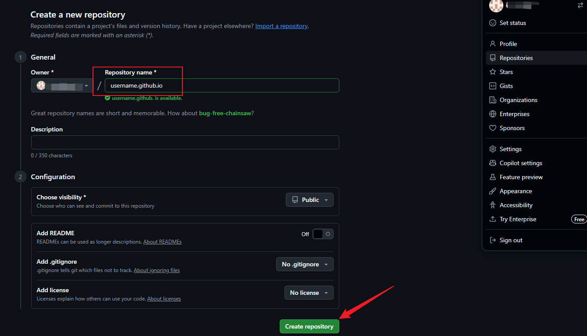
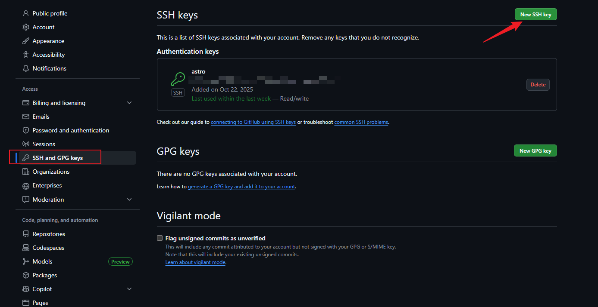
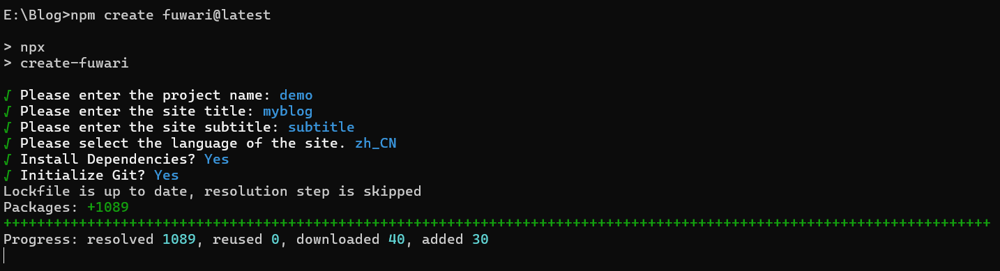
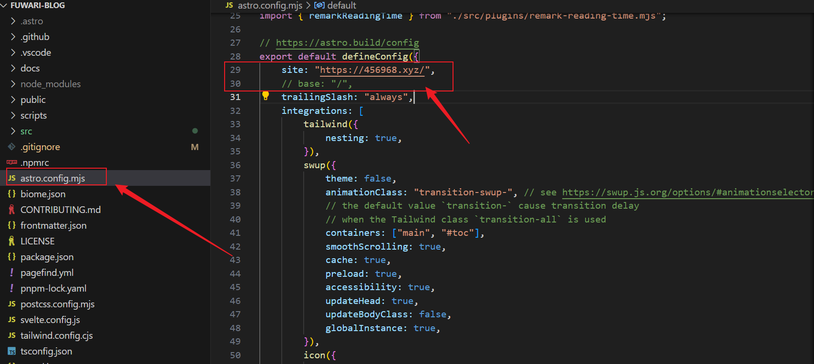
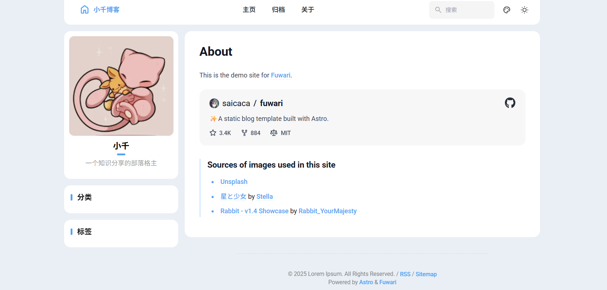
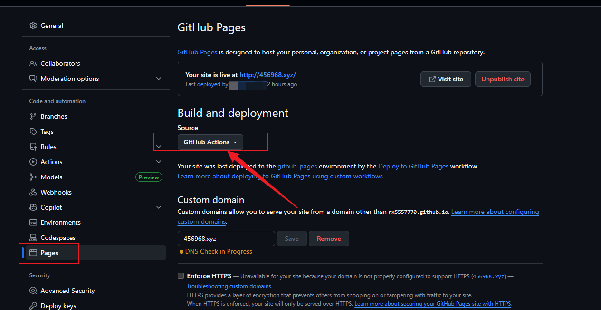

---

## 前言

通过GitHub Pages + Astro 部署的静态博客**无需自备服务器+域名**，将本地文件与互联网相通。类似的项目还有很多。

本文用到的[项目地址](https://github.com/saicaca/fuwari)
## 建站前的准备

1. GitHub账号
2. nodejs
3. git

## 进入教程

### git 配置

```shell
# 本地生成ssh公钥
ssh-keygen -t rsa -b 4096 -C "email@example.com"
```

生成公钥后去C盘的.ssh文件夹下找到 .rsa 文件，复制里面的内容。

### GitHub添加仓库

添加一个仓库然后设置名称为 `github用户名.github.io`，用户名填自己的。这个就是域名。



在用户设置中，如下粘贴刚刚的公钥。



---

### 安装

```shell
npm create fuwari@latest
```



### 配置

有两种配置：

- 没有自己的域名：
  找到 astro.config.mjs 配置 base 和 site，site设置为刚刚的域名。
- 有自己的域名：如下图配置



文章路径在 `src/content/posts/` 
左侧边栏以及头部信息路径在 `src/config.ts`
修改后，通过 `npm run dev` 即可启动。




### 通过git命令对接GitHub仓库

电脑 cd 到项目目录，然后通过git命令上传到建立的仓库。

```shell
# 验证
ssh -T git@github.com

# 设置信息
git config --global user.email "example@gmail.com"
git config --global user.name "example"
git init


git add .
git commit -m "Initial commit"
git branch -M main
git remote add origin <远程仓库URL>
git push -u origin main
```

上传后点设置，配置Action


> [!TIP]
> 也可以填写自己的自定义域名，不过我也不清楚为什么这里一直黄色。（虽然自定义域名也能用emmm），如果你有自定义于域名，那么可以通过CNAME解析到username.github.io做解析。



## 后续维护

我是通过obsidian来编写项目的markdown文件，然后通过 `git push` 来更新文章的。

当写好一篇文章后，到目录下运行

```shell
git add .
git commit -m "update post"
git push
```
