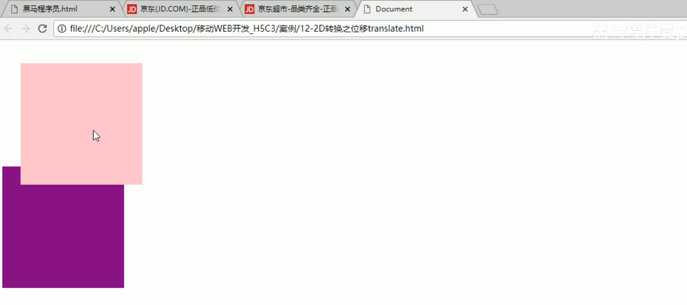
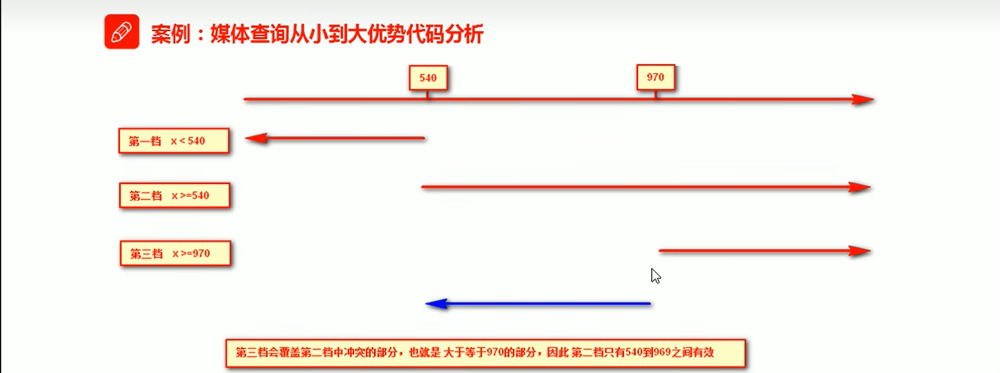

---
title: CSS
published: 2025-10-23
description: ''
image: ''
tags: ['code', 'css']
category: 代码日常
draft: false
lang: zh-CN
---
    #### 盒模型

> 盒子由 **content** **padding** **border** **margin** 四部分组成。
> padding和boreder会**增加盒模型的大小**
#### 外边距合并坍塌问题

在**标准流**中当父与子元素都是块元素，并且都设置了外边距(margin)，就会造成坍塌问题，下面是三种解决方案。

```css
.father {
	border: 1px solid transparent; /* 添加边框*/
	padding: 1px; /* 添加padding */
	overflow: hidden;
}
```

#### 子元素浮动导致父元素高度为0

在有些情况不设置父元素的高度时，当**子元素都为浮动元素**，就会导致**父元素的高度为0**，造成排版问题。可以通过下面的解决方法：

```css
.father {
	overflow: hidden;
}

/* 或者使用下面方法 */
.father::after {
    content: "";
    display: block;
    clear: both;
}
```

#### 浮动

当元素设置为浮动元素后，便不再占有页面空间，后续的元素会占据这个空间位置，但是文字和图片除外（即会显示浮动元素无法覆盖文字和图片），这点和定位不同。


#### 定位

> 固定定位和绝对定位一样不占有空间，固定定位通常是**相对于浏览器视口**（viewport）进行定位的。
> 
> 绝对定位**相对于上级元素（例如父级设置相对定位）的空间来进行位置偏移。**
> 相对定位是**相对于自身进行位置偏移，保留原先位置空间。**

> `z-index` 仅支持定位，标准流与浮动不支持。
##### 固定定位
要在居中布局的右侧添加固定定位的布局，假设居中布局的总宽度为800px，可以参考以下代码：

```css
.fixed {
	position: fixed;
	/* 先设置位置为正中心 */
	left: 50%;
	/* 外边距为居中布局总宽度的一半 */
	margin-left: 400px
}
```


##### 绝对定位

加了绝对定位不能通过 `margin:0 auto`水平居中，可以通过以下计算方法实现水平和垂直居中。假设宽与高为200px和100px.

```css
.box {
	position: fixed;
	left: 50%;
	/* 设置偏移为盒子宽度的一半，实现水平居中 */
	margin-left: -100px;
	top: 50%;
	/* 设置偏移为盒子高度的一半，实现垂直居中 */
	margin-top: -50px;
}
```

#### 精灵图

关于精灵图是需要配合 `background-position`来定位图标的，当背景图大于元素大小时，默认展示0,0的位置开始撑起，显示不全。假设需要的图标在背景图右下角，那么x和y的值都需要是负数才可以。

**y为负数代表往上移，x为负代表向左移动。**


#### CSS3

##### 过渡、移动与缩放

- 过渡:
	通过`transition`可以产生过渡动画 `transition: transform 0.5s` 第一个是监听的属性，第二个是动画时间。

- 移动:
  通过`transform:translate(x, y)`移动元素只改变元素本身的渲染外观，不会改变元素的布局空间。并且只会根据盒子自身的宽高进行移动。




- 缩放:
  默认通过`width`与`hight`设置盒子会影响到后面的盒子布局，而通过`transform: scale(x, y)`就可以避免影响。


##### 选择器之nth-child 和 nth-of-type

在使用`nth-child`选择器的时候，会先默认看子元素的排行，即使是不同元素，例如下图的p标签和div分别为1号和2号。然后再看匹配规则的前面（此处为div），所以匹配不到，因为1号元素是p而非div。


使用`nth-of-type`会优先看特定的的元素再看排行个数。


##### 动画

制作动画步骤：
1. 定义
   ```css
   @keyframes move{
	   /* 开始状态 */
	   0% {
		   transform: translateX(0px);
	   }
	   /* 结束状态 */
	   100% {
		   transform: translateX(100px);
	   }
   }
   ```
2. 调用
	```css
	.box {
		/* 动画名称 */
		animation-name: move;
		/* 动画时长 */
		animation-duration: 2s;
		/* 何时开始 */
		animation-delay: 1s;
		/* 重复次数 infinite代表无限*/
		animation-iteration-count: infinite; 
		/* 逆向播放 */
		animation-direction: alternate;
		/* 动画结束停留状态，默认backkwards 回到起始状态，设置 forwards 停留在结束状态*/
		animation-fill-mode: forwards;
	}
	```
###### 透视

透视是通过给父元素设置`perspective`属性，然后子元素设置`transform: translateZ(0px)`实现大小的变化造成3d效果。

> z值越大 显示的效果越大。透视越小，显示越大。


##### flex布局

> 父元素设置flex，子元素就可以变成块级元素，可以设置宽高，同时子元素会变成一排，并且默认不换行，如果宽度不够容纳子元素会压缩宽度。

```css
.box {
	display: flex;
	/* 默认主轴是x轴 */
	flex-direction: row;
	/* 主轴居中 */
	justify-content: center;
	/* 侧轴居中 */
	align-items: center;
}
```


`align-content` 和 `align-items`用法区别在于 content用于多行的情况下，items用于单行情况下。


##### 媒体查询

在css中可以根据不同分辨率大小设置不同的样式。推荐根据从小到大来编写，因为会利用css的层叠性来简化代码。

```css
/* <767px */
@media screen and (max-width: 767px){
	html {
        font-size: 18px;
	}
}
/* >=768px */
@media screen and (min-width: 768px){
	html {
        font-size: 25px;
	}
}
/* >=1200px */
@media screen and (min-width: 1200px){
	html {
        font-size: 30px;
	}
}
```




#### 实战小技巧

##### 背景y轴渲染不全问题

当给 `body` 设置背景的时候，如果没有提前设置`html`元素的高度会导致覆盖x轴而y轴没有撑开，例如下面这样，原因是`body`是`html`的子元素，因为`html`没有设置高度，解决的办法是设置 `html` 元素的高度为100%即可。


