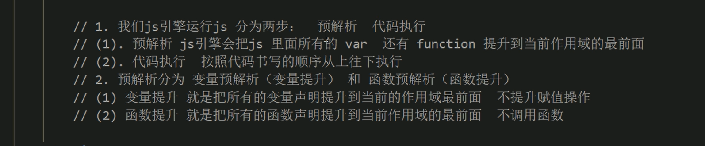
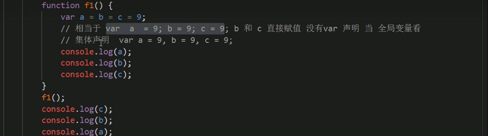
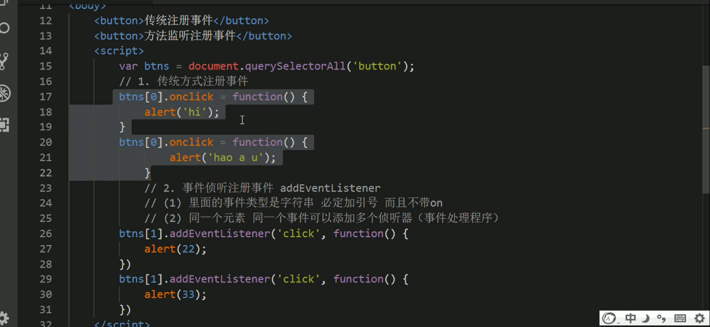
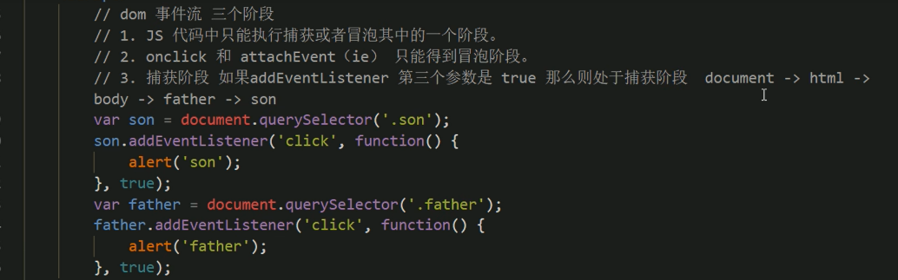
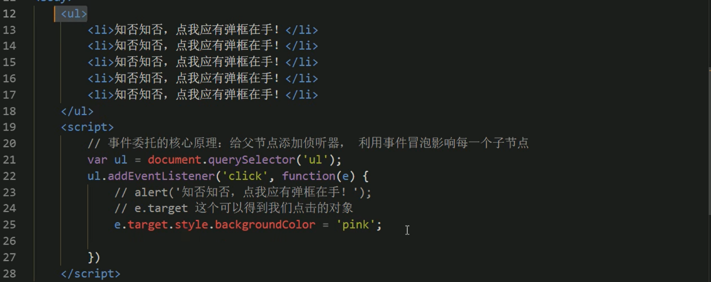
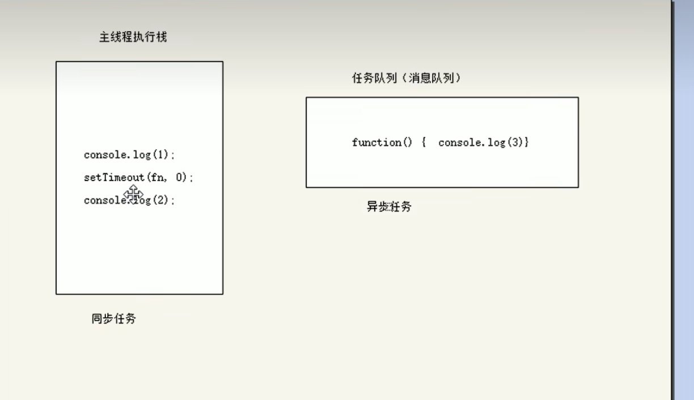
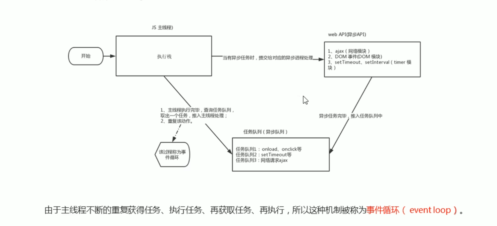

---
title: JS
published: 2025-10-23
description: ''
image: ''
tags: ['js', 'code']
category: 代码日常
draft: false
lang: zh-CN
---
    JS的核心模型是dom和bom，dom是页面元素模型，bom则是浏览器对象模型。

#### 运算符

##### 优先级

逻辑运算符的优先级是很低的，`&&`比 `||`运算符优先级高。
下面的代码可分解为:

- `4>=6`
- `"人" != "阿凡达"`
- `!(12*2 == 144)`
- `true`

因为 `&&`比 `||`运算符优先级高，所以后面的为true，再与false进行或运算，最终得到true。

```js
console.log(4>=6 || "人" != "阿凡达" && !(12*2 == 144) && true) // true
```

分解：

- `5 == num / 2`
- `(2 + 2 * num).toString() === "22"`

第一个和第二个都返回true，最终进行 `&&` 运算，得到true。
```js
var num = 10;
console.log(5 == num / 2 && (2 + 2 * num).toString() === "22");
```

#### 预解析

js引擎会把**var变量声明与函数提升到作用域最前面（变量提升但是不赋值）**，那么就可以**在函数的上方调用函数**。当遇到**函数表达式**的时候，会**当作变量而非函数**，所以**在函数表达式的上方调用是错误的。**



下面是一个案例：
```js
f1()
console.log(c)
console.log(b)
console.log(a)
function f1() {
	var a = b = c = 9
	console.log(a)
	console.log(b)
	console.log(c)
} 
```

分析：

```js
function f1() {
	// 这里相当于 var a = 9; b = 9; c = 9; b和c没有var声明当全局变量看。
	var a = b = c = 9
	// 集体声明 var a = 9, b = 9, c = 9
	// 上面的遇到解析变成 var a; a = b = c = 9然后遇到下面的打印，所以输出三个9.
	console.log(a)
	console.log(b)
	console.log(c)
} 
f1()
console.log(c) 
console.log(b)
console.log(a) // 因为上面的a是函数局部变量，所以输出undefined
```


#### 事件

传统的 onclick 是唯一性，例如同一元素设置了多个点击事件，那么会覆盖。当使用 `addEventListener` 监听多个相同的点击事件会全部触发。


##### 事件冒泡

当 `addEventListener` 设置为 `true` (默认为 `false` ) 便激活了捕获阶段，捕获阶段指当某个事件如(click)，在父元素与子元素同时设置了click事件，那么就会先执行父元素的事件函数其次是子元素。冒泡阶段指默认的 `false` 由子元素的事件优先激活然后执行父元素的事件。



##### 事件委托

本质是利用了事件冒泡，通过给父元素设置监听，来锁定激活事件的子元素（因为子元素的事件会冒泡到父元素）。


#### 同步和异步

> 浏览器同源策略（Same-Origin Policy） ：为了保护用户信息安全，防止恶意网站窃取数据。它要求AJAX请求必须发送给同源的服务器（即协议、域名、端口三者完全相同）。

js执行代码首先把任务分为同步任务和异步任务，当看到同步任务中有回调函数的时候，把回调函数放到异步任务中不执行，等到同步任务结束，再把异步任务放到同步任务的最下方执行。


##### 异步

异步函数**永远返回一个 Promise 对象**。
await后面跟着一个promise对象。
当在主程序运行了async函数，不会影响主线程，主线程会继续运行。

```js
async function getDataSafely() {
  try {
    const result = await fetchData(); // 可能会失败的异步操作
    console.log("Success!", result);
  } catch (error) {
    // 如果上面的 await 等待的 Promise 失败了，就会跳到这里
    console.error("Oops! Something went wrong:", error);
  }
}

// 对比之前的 Promise.catch：
function getDataWithPromise() {
  fetchData()
    .then(result => console.log("Success!", result))
    .catch(error => console.error("Oops!", error)); // 需要单独的 catch 方法
}
```
##### let/var 区别

在下面函数中，let声明的变量作用域在于**函数内部的if块**，而**var作用域则是在整个函数。** 现代JS更推荐使用 `let`

区别：

- 作用域不同
- 变量提升不同
- let不可同一块中重复声明
- 浏览器环境下 let声明的变量不会成为window的属性

```js
// 函数作用域 vs 块级作用域
function exampleScope() {
  if (true) {
    var varVariable = "我是 var";
    let letVariable = "我是 let";
  }

  console.log(varVariable); // 输出: "我是 var" (在if块外依然可以访问)
  console.log(letVariable); // 报错: ReferenceError: letVariable is not defined (超出了它的块作用域)
}
exampleScope();

// 提升行为
console.log(a); // 输出: undefined (声明提升了，但值是undefined)
var a = 10;

console.log(b); // 报错: ReferenceError: Cannot access 'b' before initialization
let b = 20;

// 重复声明
var x = 1;
var x = 2; // 没问题，不会报错

let y = 1;
let y = 2; // 报错: SyntaxError: Identifier 'y' has already been declared

// 浏览器环境中
var globalVar = "Global Var";
let globalLet = "Global Let";

console.log(window.globalVar); // 输出: "Global Var"
console.log(window.globalLet); // 输出: undefined
```