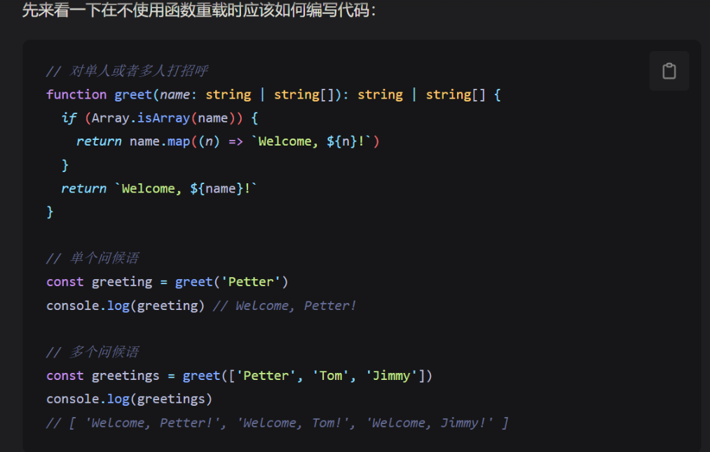

---
title: Typescript
published: 2025-10-23
description: ''
image: ''
tags: ['js', 'code']
category: 代码日常
draft: false
lang: zh-CN
---
    
### 对象

对象的类型定义有两个语法支持： type 和 interface 。

> 属性的结构跟本身一致，可以直接引用。

#### 接口

接口就相当于定义自定义对象类型，当其中的属性key后面加 `?` 代表是**可选属性**，也可以在值内**继续调用这个类型本身。**

一个接口中只能**定义一个任意属性。** 如果接口中有多个类型的属性，则可以在任意属性中使用**联合类型**，**一旦定义了任意属性，那么确定属性和可选属性的类型都必须是它的类型的子集**

继承：当有一个模板对象后，通过继承可以剔除/添加一些属性，相当于对原有接口进行改装。
```ts
interface UserItem {
  name: string
  age: number
  enjoyFoods: string[]
  friendList?: UserItem[] // 可选参数
}

// 这里在继承 UserItem 类型的时候，删除了两个多余的属性
interface Admin extends Omit<UserItem, 'enjoyFoods' | 'friendList'> {
  permissionLevel: number
}

// 现在的 admin 就非常精简了
const admin: Admin = {
  name: 'Petter',
  age: 18,
  permissionLevel: 1,
}

interface Person {
    readonly name: string; // 设置只读，根据接口产生的对象不可更改值，只在第一次赋值的时候设置。
    age?: number;
    //[propName: string]: string;定义了任意属性取 `string` 类型的值。
    [propName: string]: any;
}

let tom: Person = {
    name: 'Tom',
    gender: 'male'
};

```

#### 类
类可以继承类也可以继承接口，可以使用 `Omit` 来剔除不需要的方法

```ts
class UserBase {
  name: string
  constructor(userName: string) {
    this.name = userName
  }
  // 这是一个方法
  getName() {
    console.log(this.name)
  }
}

// 接口继承类的时候也可以去掉类上面的方法
interface User extends Omit<UserBase, 'getName'> {
  age: number
}

// 最终只保留数据属性，不带有方法
const petter: User = {
  name: 'Petter',
  age: 18,
}
```

#### 函数

函数也是需要定义参数类型与返回值类型的。

**可选参数后面不允许再出现必需参数**，所以要把可选参数放到后面。当可选参数有默认值，那么就可以不受刚刚的规则了
##### 函数重载

在不使用重载的时候遇到返回值是多个可能的类型的需要填写的比较多，而且不美观。通过函数重载就可以更加直观分析代码。



```ts
// 这一次用了函数重载
function greet(name: string): string  // TS 类型
function greet(name: string[]): string[]  // TS 类型
function greet(name: string | string[]) {
  if (Array.isArray(name)) {
    return name.map((n) => `Welcome, ${n}!`)
  }
  return `Welcome, ${name}!`
}

// 单个问候语，此时只有一个类型 string
const greeting = greet('Petter')
console.log(greeting) // Welcome, Petter!

// 多个问候语，此时只有一个类型 string[]
const greetings = greet(['Petter', 'Tom', 'Jimmy'])
console.log(greetings)
// [ 'Welcome, Petter!', 'Welcome, Tom!', 'Welcome, Jimmy!' ]
```

#### 数组

使用「类型 + 方括号」来表示数组

```ts
let fibonacci: number[] = [1, 1, 2, 3, 5];

```