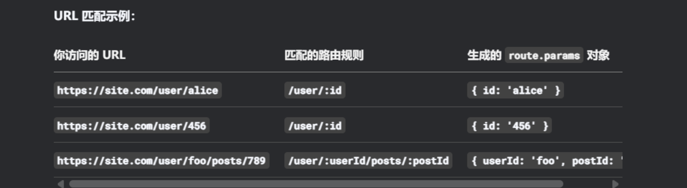
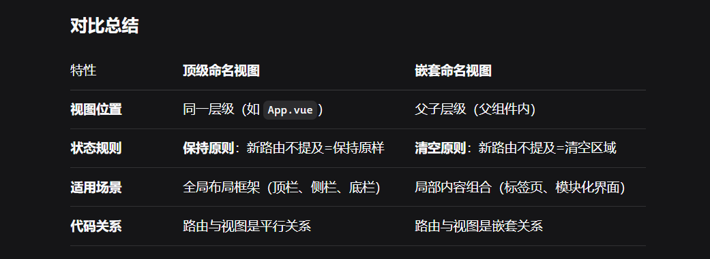
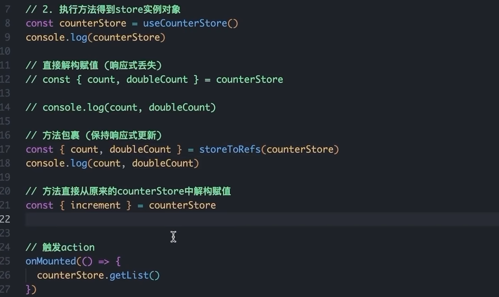

---
title: Vue
published: 2025-10-23
description: 这是关于Vue3的学习记录。
image: ''
tags: ['vue3', 'code', 'js']
category: 代码日常
draft: false
lang: zh-CN
---
    #### 项目命令

- `npm init vue@latest`: 创建项目
- `npm run dev`: 启动项目

#### vue语法

##### 导入

可以通过script标签引用官方的vue.js来使用这个框架，`new Vue` 这个实例的参数是个对象需要传递 `el` 和 `data`。el可以使用css的选择器，然后就可以在**指定的元素区域内使用模板语法（非单标签元素，body和html也是不行的）。**


##### 基本命令

###### v-text/v-html
给标签添加 `v-text`属性，属性值就可以是js传递过去的变量，在这个属性值内也可以进行字符串拼接，不过这个属性会替换这个标签的文字内容，js传递过去的文本会完全覆盖掉原本内容。（使用模板语法就不会导致这种情况。）

v-html**只会覆盖这个元素内部的HTML内容**。


###### v-if/v-show

v-show 会设置元素的`display`值来隐藏与显示元素（保留元素），v-if会通过值来决定是否直接渲染元素（false时直接不保留这个元素。）

###### v-for

`v-for`属性设置在元素中例如 `li` 标签 然后语法是 `(item, index) in data`，data是可迭代的js变量。可以搭配 `v-bind` 来使用。同时要注意**添加 `key`属性作为唯一标识，不加的话可能导致逻辑错误。** **遍历数组是`(item, index)`，当遍历的是对象则是 `(value, key, index)` 。**


###### v-model

`v-model` 是双向数据绑定，常用于表单。当修改了js的变量时这个表单的文本也会改变，当修改了这个表单的文本时，js变量也会改变。


###### 指令装饰符

`v-model.trim`: 自动去除首尾空格。
`v-model.number`: 尝试转换为数字。
`@click.stop="son_func"`: 给子元素添加点击事件并且阻止事件冒泡到父元素。
`@click.prevent`: 阻止默认行为。

```html
name: <input v-model.trim="username" type="text">
age: <input v-model.number="age" type="text">
<a @click.prevent href="http://baidu.com">阻止默认行为</a>
```

###### 类名追加

`:class`: 不会覆盖原类名，只会根据里面的表达式来追加类名。

```html
<div class="box" :class="{ 类名1: true, 类名2: false }"> box </div>
<div class="box" :class="[类名1, 类名2]"> box </div>
```


##### setup
下面是原始写法：

在 `script` 标签中导出 `setup` 和 `beforeCreate` 函数会发现 `setup` 先执行然后是 `beforeCreate` 函数。在 `setup` 中定义的变量和函数需要以对象形式 `return` 出去才能供页面使用。


语法糖写法（在script标签后面添加setup就可以自动return变量和函数。）：


##### reactive 和 ref 响应式

> reactive需要传入对象类型的参数，ref则传入基本类型/对象类型。通过ref返回的对象需要.value才能更改数值。

reactive：


ref：


一般情况下会产生两个混用，导致代码混乱，那么可以把 `ref` 传入 `reactive` 里面，这样最终只需要访问这个 `reactive` 对象的ref类型的属性，而不需要再加 `.value` 来访问与设置值，依旧是响应式。

```js
import { ref, reactive } from 'vue';
const count = ref(0);
// 创建一个 reactive 对象，并将上面的 ref 作为其属性
const state = reactive({
  count // 等同于 count: count
});

// 【访问时自动解包】
// 我们并没有写 `state.count.value`，而是直接 `state.count`
// Vue 自动为我们解包，获取了 `count.value` 的值
console.log(state.count); // 输出：0

// 【修改时自动解包】
// 我们直接给 `state.count` 赋值一个普通数字
// Vue 会自动将这个值赋给 `count.value`
state.count = 1;

// 验证：原始的 ref 的 .value 也被改变了
console.log(count.value); // 输出：1
```

当使用解包来解析响应式对象时，解包出来的就会丢失响应式，可以通过 `toRefs` 来解包依旧响应式。(修改需要添加 .value)


##### computed计算属性

> 计算属性和方法差不多但是可以被vue缓存，提高性能。

例如我有一个数据集合 `[data1, data2, data3]` 当我设置定时器三秒后添加元素`[data4, data5]`，并且我有一个特定数据的展示区（根据条件过滤了原始数据），例如符合条件的为 `data2, data3` 和 之后要添加元素的data4和data5，那么要想实时过滤，就需要用到计算属性 `computed`


##### watch监听

> **主要用于监听响应式数据的变化**

> 当监听的是ref类型，默认是**浅度监听**，如果传入的是对象类型，那么当数据改变，watch是不会执行回调的。
```js
import { ref, watch} from 'vue'
const count = ref(0)
const name = ref("name")

// 当数据变化时执行
watch(count, (newVal, oldVal) => {
	console.log(newVal, oldVal)
})

// 监听变量后立即执行一次回调函数
watch(count, (newVal, oldVal) => {
	console.log(newVal, oldVal)
}, {
	immediate: true
})

/* 
监听多个数据
参数1：传入列表
参数2： 传入回调函数 参数是两个列表 分别是新值与旧值
*/
watch([count, name], (
[newCount, newName],
[oldCount, oldName]
) => {
	console.log("name/count改变了")
}
)
```


默认监听：


深度监听（在第三个参数传递 `{deep: true}` 即可。不过deep损耗性能一般不建议开启。）：


###### 监听对象特定属性

当需要监听对象的时候（属性name，age），watch开启了deep，那么不论age和name谁发生变化都会导致运行回调函数，如果需要监听对象的特定属性，就需要改变watch写法。传递给watch两个回调函数，第一个返回监听的属性，第二个是数据变化时的回调函数。


##### DOM更新渲染问题

vue的响应式更新与页面并不是同时性的，也就是说，js那里改的值，会有一段时间要去处理绑定的dom，导致了dom元素依旧保持上次的状态。修改了响应式数据后，立即直接操作DOM，无法获取到最新的DOM结构。

可以通过 `nextTick` 来读取最新DOM结构。

```html
<template>
  <div ref="myDiv">{{ message }}</div>
  <button @click="changeMessage">Change Message</button>
</template>

<script setup>
import { ref, nextTick } from 'vue';

const message = ref('Hello');
const myDiv = ref(null);

const changeMessage = async () => {
  message.value = 'Hello World!'; // 修改数据

  // 此时DOM还没有更新，这里拿到的是旧的内容
  console.log(myDiv.value.textContent); // 输出：'Hello'

  // 使用 nextTick 等待DOM更新
  nextTick(() => {
    // 现在DOM已经更新了，这里拿到的是新的内容
    console.log(myDiv.value.textContent); // 输出：'Hello World!'
  });

  // 或者用 async/await 语法，更优雅
  await nextTick();
  console.log(myDiv.value.textContent); // 输出：'Hello World!'
};
</script>
```


##### 组件

###### 注册组件

可以在main.js中导入组件并通过 `component` 注册全局，这样其余的组件就可以不需要导入，直接就可以引用。


###### 父传子

组件可以引用，也就是一个vue文件引用另一个vue文件。父组件给子组件绑定属性需要先导入子组件，然后绑定属性，子组件通过 `defineProps`来接受父组件传递的属性和值。


通过子组件定义 `slot`占位符可以接收父组件传递的内容。


在子组件中 `slot` 也可以定义 `name` ，这样父组件就可以通过 `name` 标识来区分传入的数据到子组件的特定位置了。父组件的 `v-slot` 对应着子组件的 `slot name`，可以通过缩写方式: `<template #标识>`

```html
// 子组件
<div class="container">
  <header>
    <slot name="header"></slot>
  </header>
  <main>
    <slot></slot>
  </main>
  <footer>
    <slot name="footer"></slot>
  </footer>
</div>

// 父组件引用
<BaseLayout>
  <template v-slot:header>
    <!-- header 插槽的内容放这里 -->
  </template>
  
  <template #default>
  </template>
  
  <template #footer>
    <!-- footer 插槽的内容放这里 -->
  </template>
</BaseLayout>
```

当父组件传递给子组件只有内容而没有header和footer时，最终渲染依旧是空的标签占据空间，可以通过 `v-if` 和 `$slots` 来进行渲染优化，**当父组件没有传递，则不渲染。**

```html
<!-- 使用者这么用 -->
<MyCard>
  <p>只有内容，没有头部和底部</p>
</MyCard>

<!-- 组件内部渲染结果 -->
<div class="card">
  <div class="card-header"> <!-- 空的头部div仍然被渲染出来了！ -->
    <!-- 这里什么都没有 -->
  </div>
  <div class="card-content">
    <p>只有内容，没有头部和底部</p>
  </div>
  <div class="card-footer"> <!-- 空的底部div也被渲染了 -->
    <!-- 这里什么都没有 -->
  </div>
</div>

// 子组件添加条件渲染
<template>
  <div class="card">
    <!-- 1. 条件渲染头部包裹层 -->
    <div v-if="$slots.header" class="card-header">
      <slot name="header" />
    </div>
    
    <!-- 2. 条件渲染内容区包裹层 -->
    <div v-if="$slots.default" class="card-content">
      <slot />
    </div>
    
    <!-- 3. 条件渲染底部包裹层 -->
    <div v-if="$slots.footer" class="card-footer">
      <slot name="footer" />
    </div>
  </div>
</template>

// **作用域插槽**
// 子组件传递参数给父组件，父组件通过获取到的数据（加工）再传入子组件
// 1.子组件
<template>
  <div>
    <!-- 在 <slot> 上绑定属性，这被称为“插槽 props” -->
    <slot :text="greetingMessage" :count="1"></slot>
  </div>
</template>

<script setup>
import { ref } from 'vue'
const greetingMessage = ref('Hello from child!')
</script>

// 2. 父组件
<template>
  <MyComponent v-slot="{ text, count }">
    收到消息: {{ text }}， 计数: {{ count }}
  </MyComponent>
</template>
```


---

> 子组件解析父组件传递的内容时，如果想单独提取数据，**推荐使用计算属性。**

> 当限制了传入类型的时候，如有布尔类型，需要放在最前面。

```js
const props = defineProps(['initialCounter']) // 响应式 props
const counter = ref(props.initialCounter)     // 独立的 ref

// 相当于：
const initialValue = props.initialCounter // 只是当前值的快照
const counter = ref(initialValue)         // 创建独立的响应式引用

// 计算属性
const props = defineProps(['initialCounter'])
const counter = computed(() => props.initialCounter) // ✅ 始终同步

// 类型检查
const props = defineProps([
  propA: Number,
  // 多种可能的类型
  propB: [String, Number],
  // 必传，且为 String 类型
  propC: {
    type: String,
    required: true
  }
])


class Person {
  constructor(firstName, lastName) {
    this.firstName = firstName
    this.lastName = lastName
  }
}
// 校验 author prop 的值是否是 Person 类的一个实例。
defineProps({ author: Person })
```

**透传**：

当父组件给子组件绑定事件与属性的时候，默认子组件是会接收的（通过dom元素），如果子组件的根元素也是组件，那么就会一直向下传递，直到遇到dom元素并为其绑定事件与属性。（在传递的过程中如果被prop/emits接收便不会继续向下传递）


透传机制：Vue 会自动将父组件上未声明的属性和事件监听器绑定到子组件的根元素上。
v-on 继承：父组件的 @click 等事件监听器会透传下去，如果子组件根元素有原生事件，两者会合并触发。

深层继承：透传会穿透多个组件层级，一直传递到第一个原生 HTML 元素为止。

停止条件：透传会在某个组件声明了该属性（props）或事件（emits） 时停止。声明了的就被视为被该组件“消费”了。

例如有时根组件为div，而子组件为button，默认的透传就会直接传到div而非button，这时就需要关闭透传。 `v-bind="$attrs"` 表示把接收的属性全部应用到这个元素上。

```html
<script setup>
defineOptions({
  inheritAttrs: false
})
</script>

<div class="btn-wrapper">
  <button class="btn" v-bind="$attrs">Click Me</button>
</div>
```
###### 子传父

在父组件中导入子组件然后通过@添加属性，值是回调函数的名字，子组件通过 `defineEmits` 函数传入刚刚设置的属性名来生成一个emit，最后通过emit函数来传数据给父组件，参数1是父组件设置的属性名，参数2是返回内容。

1. 子组件内：`emit('事件名', 数据)`
2. 父组件内：`@事件名="处理函数"` 
3. 处理函数的参数，自动接收子组件传过来的数据。


事件校验：子组件在 `emit` 之前，自己对自己要发出的事件进行一次自我检查，确保发出的数据是合规的。

```js
// 1. 使用对象形式的 defineEmits 来定义事件和它们的校验规则
const emit = defineEmits({
  // 2. 这个 'click' 事件不需要校验，传 null 就行
  click: null,

  // 3. 重点：为 'submit' 事件配置一个校验函数
  submit: ({ email, password }) => {
    // 校验函数会接收到 emit 发出的所有参数（这里是一个对象 {email, password}）
    // 然后我们把这个对象解构，直接拿出 email 和 password

    // 4. 校验逻辑：如果 email 和 password 都有值（为真），则校验通过
    if (email && password) {
      return true // 返回 true，表示事件合法，允许发出
    } else {
      // 5. 如果校验失败，在控制台打印一个警告（方便开发者调试）
      console.warn('Invalid submit event payload!')
      return false // 返回 false，表示事件不合法，这次 emit 会被阻止
    }
  }
})

function submitForm(email, password) {
  // 6. 当调用 emit 时，Vue 会先自动执行上面定义的校验函数
  // 只有校验函数返回 true，这个 'submit' 事件才会真正被发出去
  // 如果返回 false，父组件就根本收不到这次事件通知
  emit('submit', { email, password })
}
```

###### defineModel 双向绑定

子组件要想与父组件共享状态，操作数据可以通过 `v-model` 与 `defineModel` 实现。

1. 父组件在子组件上设置 `v-model` 的值
2. 子组件通过 `defineModel` 获取，返回的值是一个 ref。

```js
// 使 v-model 必填
const model = defineModel({ required: true })

// 提供一个默认值
const model = defineModel({ default: 0 })
```


也可以像 `v-bind` 一样通过 `:` 来设置文本标识

```html
// 父组件引用子组件
<MyComponent v-model:title="bookTitle" />

// 子组件通过标识获取
<script setup>
const title = defineModel('title')

// 也可以这样
const title = defineModel('title', { required: true })

</script>

<template>
  <input type="text" v-model="title" />
</template>
```

也可以使用自定义修饰符，以下代码实现了子组件的 `input` 与父组件的 `p` 标签同步，并且使用了自定义修饰符，输入的内容会输出大写。

1. 父组件在 `v-model` 添加修饰符（代表一个开关）
2. 子组件解包会得到数据与修饰符标识，然后编写set函数（当子组件要修改值（比如输入内容）时，这个函数会被调用）并返回

```html
// 父组件
<template>
  <div>
    <!-- 使用自定义的 .capitalize 修饰符 -->
    <MyComponent v-model.capitalize="myText" />
    <p>父组件的值: {{ myText }}</p> <!-- 这里显示的值将会是首字母大写的 -->
  </div>
</template>

<script setup>
import { ref } from 'vue'
import MyComponent from './MyComponent.vue'

const myText = ref('hello') // 初始值是全小写
</script>

// 子组件
<script>
// 解构赋值！model 是数据，modifiers 是修饰符对象
const [model, modifiers] = defineModel({
  // set 函数：当子组件要修改值（比如输入内容）时，这个函数会被调用
  // 它接收一个参数：原始的新值（比如用户刚输入的 'apple'）
  // 它需要返回一个值：经过处理后的最终值（返回给父组件的东西）
  set(value) {
    let finalValue = value // 先默认不做处理

    // 检查是否有 capitalize 修饰符
    if (modifiers.capitalize) {
      // 实现首字母大写的逻辑
      // 例如：输入 'apple' -> 变成 'Apple'
      finalValue = value.charAt(0).toUpperCase() + value.slice(1)
    }

    // 返回最终处理过的值，这个值才会真正更新到父组件的 myText 上
    return finalValue
  }
})

</script>
<template>
  <input type="text" v-model="model" />
</template>
```
###### 跨层组件通信


当根组件想要与底层组件传递数据（中间隔了层级），需要在根组件调用 `provide`函数，然后底层组件调用 `inject`接收，两者需要相同的key。默认子组件接收后可以修改传递源的内容。

> 可以传递响应式数据和函数

```js
// 根组件
import { provide, readonly } from 'vue'
provide('data-key', 'data....')

// 设置只读
const count = ref(0)
provide('read-only-count', readonly(count))

// 底层组件
import { inject } from 'vue'
const data = inject('data-key')
```


###### 父子组件生命周期

父组件引用了 `input` 和 `list` 子组件

###### ref标识

设置dom元素中设置 `ref`的值为js脚本的变量后，在js中通过组件加载`onMounted`后获取这个dom元素的值，也可以为组件设置 `ref`标识，vue组件默认不暴露，要想获取被导入组件里面的属性和方法，可以通过 `defineExpose` 来暴露。


ref标识也可以用于父组件调用子组件方法。


###### 动态渲染组件

常用于网站的 tab 切换，例如有个登录和注册的tab选项卡，当切换到注册，tab页面就会被卸载（原先数据丢失，即不保存填入的文本内容），这种情况需要保持页面活性。

`component`: 有一个is属性接收组件名/组件对象，最终渲染页面。被切换掉的组件会被卸载（可通过 `<KeepAlive>` 保持活性）。

当子组件是使用了 `v-if` 根据条件渲染，那么可以通过外面套一层 `KeepAlive` 保持活性，那么**即使最终页面切换了，再次切换也会恢复内容。**

> 使用 `<script setup>` 的单文件组件会自动根据文件名生成对应的 `name` 选项，无需再手动声明。（通过name来筛选名单）

```html
<!-- 父组件-->
<script setup>
import Home from './Home.vue'
import Posts from './Posts.vue'
import Archive from './Archive.vue'
import { ref } from 'vue'

const currentTab = ref('Home')

const tabs = {
  Home,      // 简写，相当于 Home: Home
  Posts,     // Posts: Posts
  Archive    // Archive: Archive
}
</script>

<!-- 手动写法 -->
<Home v-if="currentTab === 'Home'" class="tab" />
<Posts v-else-if="currentTab === 'Posts'" class="tab" />
<Archive v-else-if="currentTab === 'Archive'" class="tab" />

<!-- 动态组件写法（简洁多了！） -->
<component :is="tabs[currentTab]" class="tab"></component>

<!-- 非活跃的组件将会被缓存！ -->
<KeepAlive>
  <component :is="activeComponent" />
</KeepAlive>

// include 白名单 exclude 黑名单
<KeepAlive :include="['a', 'b']">
  <component :is="view" />
</KeepAlive>
```


###### Suspense

使用 `Suspense` 组件包裹异步组件，可以设置加载完毕后/加载中的状态信息。


###### 组件获取全局属性

组件导入 `getCurrentInstance` 后，可以获取全局设置的属性。


##### DOM内模板和字符串模板

Dom内模板：在html中引用vue（需要遵循html规范）
字符串模板：直接在vue里面编写 `template` 标签写内容。

##### 路由

在vue中配置了路由就可以实现url的刷新与组件刷新，同时网站不刷新，能够减少网络请求。

安装：`npm install vue-router@4`
###### 匹配规则

注册路由插件：`createApp(App).use(router).mount('#app')`

自定义路由规则：例如规则是 `/user/:id`，访问的url为 `https://site.com/user/alice` 那么`route.params` 对象为 `{ id: 'alice' }`，生成的这个 `route.params` 对象的key对应着匹配到的 `:` 后面的规则。被设置路由的组件可以通过 `$route.params` 对象获取传递的值。

> 当二级路由的 `path` 为空，代表一级路由与这个二级路由同时渲染。


> strict 和 sensitive 默认是 false

`strict` : 最后的斜杠是否严格匹配
`sensitive`: 路径的大小写是否严格匹配

```js
import { createMemoryHistory, createRouter } from 'vue-router'

import HomeView from './HomeView.vue'
import AboutView from './AboutView.vue'

const routes = [
  // 静态路由
  { path: '/', component: Home },  
  // 动态路由：匹配 /user/xxx，其中 xxx 是任意值
  // 匹配 /user/abc，但不匹配 /user/abc/123和/user/
  { 
    path: '/user/:id', // :id 是参数名，可以自定义
    component: UserProfile // 用于渲染所有用户的组件
  },
  
  // 更复杂的例子：匹配 /user/xxx/posts/yyy
  {
    path: '/user/:userId/posts/:postId',
    component: UserPost
  },

    // 将匹配 /users, /Users, 以及 /users/42, /users/ 或 /users/42/ (在全局的 strict 和 sensitive 都采用默认值（false）的情况下)
    { path: '/users/:id?' },
  
  // 通配符放最后
	{
	// 匹配所有路径
	path: '/:pathMatch(.*)*', // 使用这个语法
	name: 'NotFound', // 给它起个名字方便跳转
	component: NotFound // 你的自定义 404 组件
  }
]

const router = createRouter({
  history: createMemoryHistory(),
  routes,
})
```


###### 监听路由变化

当用户从 `/users/johnny` 导航到 `/users/jolyne` 时，**相同的组件实例将被重复使用**。因为两个路由都渲染同个组件，比起销毁再创建，复用则显得更加高效。**不过，这也意味着组件的生命周期钩子不会被调用**。

```html
<script setup>
import { watch } from 'vue'
import { useRoute } from 'vue-router'

const route = useRoute()

watch(() => route.params.id, (newId, oldId) => {
  // 对路由变化做出响应...
})
</script>
```

###### 嵌套路由

普通嵌套路由和这种“忽略父组件”的嵌套路由**在路径结构上完全一样，但在组件渲染和行为上有着根本的区别**。普通嵌套路由需要提供一个父组件来渲染，然后再根据嵌套路由继续渲染，而忽略父组件路由时不传递 `component` 即不渲染父组件，子组件直接跳到上级的 `<router-view>` 中渲染。


```js
// 普通嵌套路由
const routes = [
  {
    path: '/user/:id',
    component: User,
    children: [
      {
        // 当 /user/:id/profile 匹配成功
        // UserProfile 将被渲染到 User 的 <router-view> 内部
        path: 'profile',
        component: UserProfile,
      },
      {
        // 当 /user/:id/posts 匹配成功
        // UserPosts 将被渲染到 User 的 <router-view> 内部
        path: 'posts',
        component: UserPosts,
      },
    ],
  },
]

// 忽略父组件路由
const routes = [
  {
    path: '/admin',
    children: [
      { path: '', component: AdminOverview },
      { path: 'users', component: AdminUserList },
      { path: 'users/:id', component: AdminUserDetails },
    ], 
  },
]
```

###### 读取路由传入的参数

可以在路由定义的时候添加 `name` 属性然后在父组件 `:to` 传入一个对象（对象里面的 `name` 参数与路由定义的 `name` 一致。）

> 所有路由的命名**都必须是唯一的**。


```js
// 路由
const routes = [
  {
    path: '/user/:username',
    name: 'profile', 
    component: User
  }
]
```

```html
// 父组件
<router-link :to="{ name: 'profile', params: { username: 'erina' } }"> User profile </router-link>
```

###### 编程式导航

所谓编程式导航便如字面意思，之前是通过页面插入 `<roter-link>` 来部署，现在可以通过代码创建跳转。

通过`router.push` 方法。这个方法会向 history 栈添加一个新的记录，所以，当用户点击浏览器后退按钮时，会回到之前的 URL。

也可以直接替换当前位置，例如一个登录页，当登录页操作完毕后，禁止回退：

```js
router.push({ path: '/home', replace: true })
// 相当于
router.replace({ path: '/home' })
```

###### 命名视图

核心思想：**一个网址，同时控制页面的多个部分**

普通的路由是：**换网址 -> 整个页面内容全变**。  
命名视图的路由是：**换网址 -> 只更换页面中你指定的那几个部分，其他部分保持不变**。

例如下面代码中 `/admin` 切换到 `/admin/users` 会切换主内容， `sidebar` 和 `topbar` 会沿用上次被激活的状态，所以这里只变内容。

```js
// 路由配置
{
  path: '/admin',
  components: {
    default: AdminDashboard, // 主内容区
    sidebar: AdminSidebar,   // 侧边栏始终保持这个组件
    topbar: AdminTopbar      // 顶部栏始终保持这个组件
  }
},
{
  path: '/admin/users',
  components: {
    default: UserList,       // 主内容区变了！
    // sidebar 和 topbar 没有定义，则它们不会被修改，继续保持原来的组件
    // 如果希望它们也变化，需要在这里重新定义
  }
}
```

###### 嵌套命名视图

- **顶级视图**（如顶栏、侧栏）通常是**全局性**的，独立于主内容。无论主内容怎么变，它们都应该存在。
    
- **嵌套视图**` <router-view>` 在**父路由组件内部**。子路由的 `components` 配置是**全新指令**，**不提及**的视图会被**清空**。(所有 `<router-view>` 都在**同一层级**)
    


###### 路由守卫

例如一个login页面，如果用户已经登录过了，就不应再可以访问；如果未登录，则跳转到login页面，其他页面不允许访问。可以通过 `router.beforeEach` ，然后导入到 `main.js` 里面启动。


#### Pinia

> Pinia 是 Vue.js 的**官方状态管理库**，用于在 Vue 应用中集中管理全局状态

假设项目通过根组件设置了金额100，在组件越来越多的情况下依旧需要编写更多代码来获取根组件状态，根组件就需要每个组件来发送状态，子组件就需要一个个的添加代码获取父组件/根组件的状态，显得很繁琐，通过Pinia可以简化这些。

安装命令：`npm install pinia`


---
##### 解包响应丢失问题

当引用store组件时，需要调用来获取实例对象，在实例对象中才会包含之前定义的状态，直接解包会导致响应式丢失，需要用到 `storeToRefs`方法，**用了这个方法不能解包函数，函数还是需要从原来的实例对象中解包。**




#### Native UI

安装：
`npm i -D naive-ui`
`npm i -D @vicons/ionicons5`

导入：
```
import naive from 'naive-ui'
app.use(naive)
```
