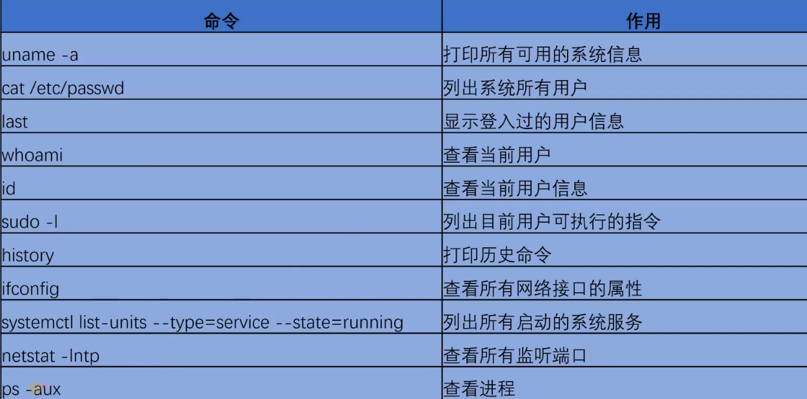
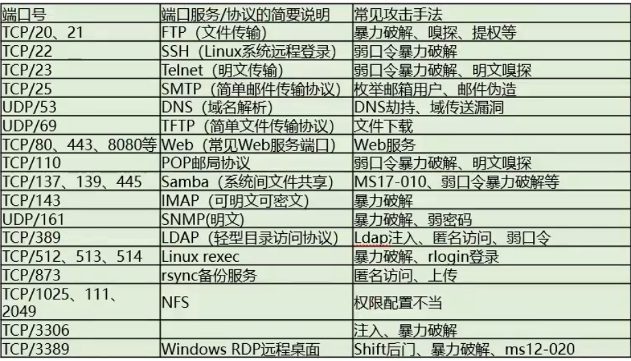
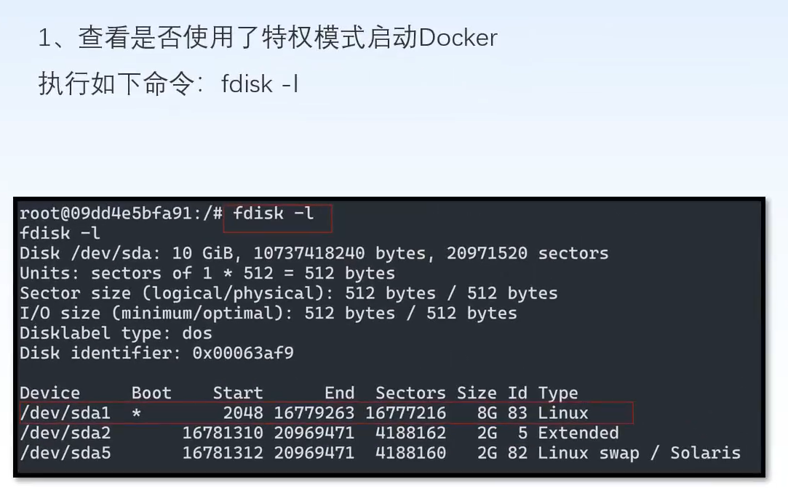
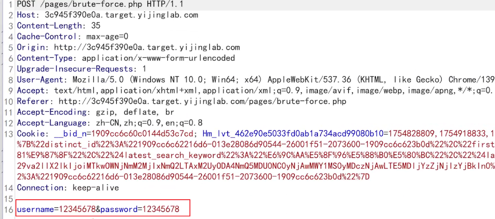
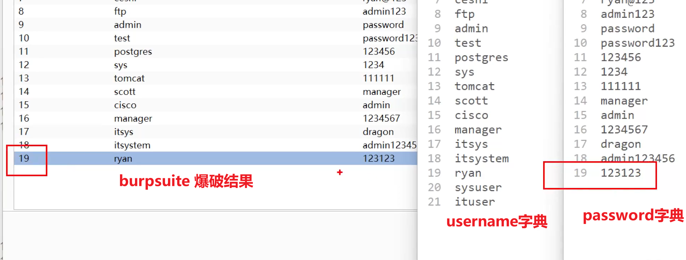
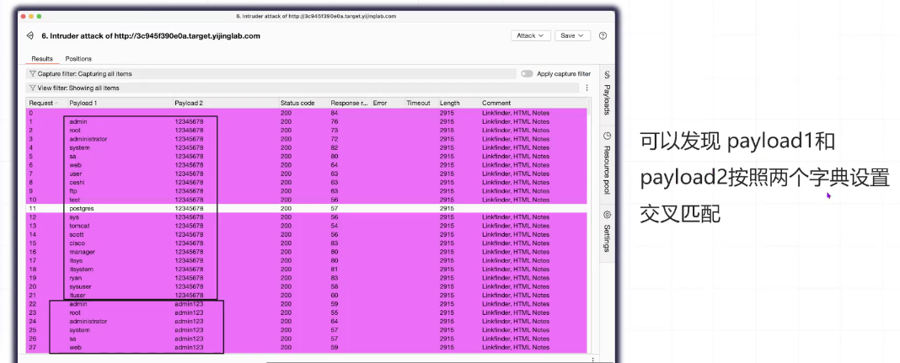
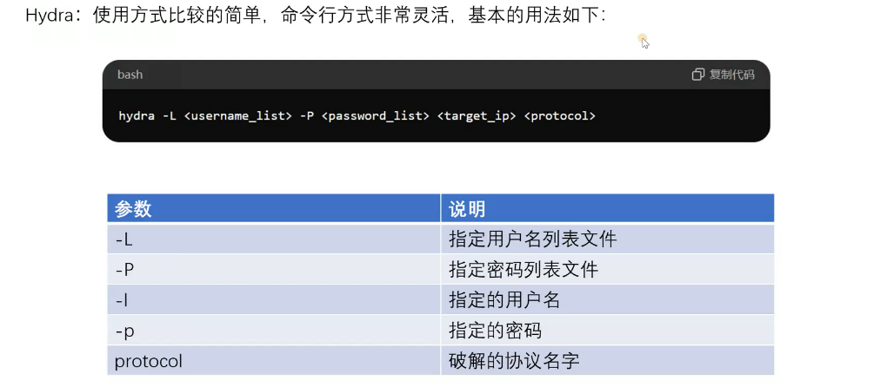
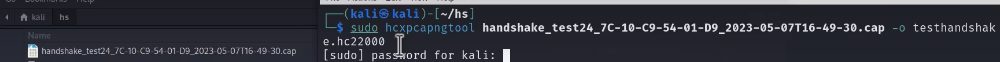

---
title: 骇客笔记
published: 2025-10-23
description: 目标——骇客！
image: ''
tags: ['code', 'kali']
category: 代码日常
draft: false
lang: zh-CN
---
    ### 基本Linux命令

```shell
# ssh登录
ssh root@tagip
# 扫描同网段下的主机
sudo netdiscover -r 192.168.1.0/24
# 删除用户 
userdel -r username
# 列出系统信息
uname -a
# 查看系统所有用户
cat /etc/passwd
# 登陆过的用户信息
last
# 当前用户
whoami
# 当前用户信息
id
# 目前用户可执行命令
sudo -l
# 历史命令
history
# 查看进程
ps -aux
# 查看硬盘/分区信息
fdisk -l
```


### Nmap

Nmap常用于端口扫描

```shell
# -O 代表扫描操作系统 -sV代表扫描服务版本
nmap -O -sV tagip
```


### hashcat

hashcat用于破解hash值，通过密码库来hash匹配目标hash，速度极快。

```
hashcat -m <modetype> <hash_value> <data_words>
```

### docker逃逸

通过 `ls -a / dockerenv` 判断是否处于docker容器内。

当入侵后发现处于docker容器内，首先判断当前容器是否是特权模式启动。（通过 `fdisk -l` 来判断）然后通过 mount 来挂载到原生系统，进行挂马渗透。



### Burpsuite

该工具有四种攻击模式：

1. 狙击手模式：标记指定位置并使用字典爆破
2. 攻城锤：标记多个位置，通过字典爆破，被标记的值相同。
3. 音叉模式：定义特定的标记对应特定的字典，例如位置a则对应a字典，位置b对应b字典，它们一一对应，最终爆破字典依最小的那个字典行数决定。
4. 集束炸弹：字典a与字典b交叉匹配，a字典的每一条都与b字典每一条匹配，并非一行一行对应。

攻城锤：



音叉模式：



集束炸弹：



### Hydra

```shell
hydra -L <username_list> -P <password_list> <target_ip> <protocol>
```



### wifite

基本上输入wifite就可以使用了，自动开启网卡的监听模式以及扫描wifi。
```shell
# cap文件转换为hash
hcxpcapngtool <capfile> -o <outfile>
```

