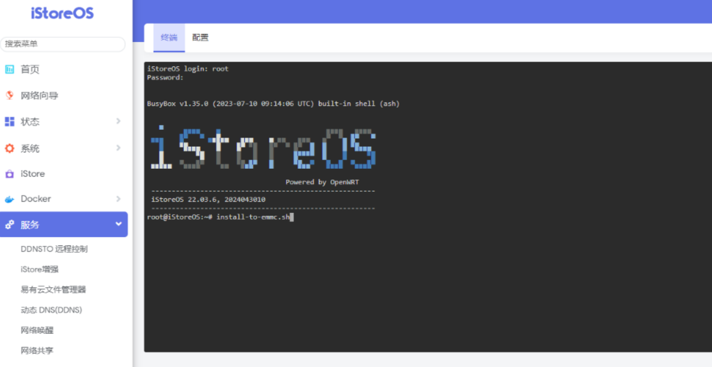

---
title: 本地设备折腾笔记
published: 2025-10-23
description: ''
image: ''
tags: ['code']
category: 代码日常
draft: false
lang: zh-CN
---
    
## Windows重装

在没有U盘的情况下，通过Windows官方的media程序与ISO镜像文件即使勾选了全部删除，依旧无法清理D/E等盘符的内容，只会重置了C盘。通过media程序，安装到U盘后，在Windows高级启动中选择U盘即可进入引导重装程序。

## 清理盘符

在U盘启动的引导程序中使用 `shift+f10` 弹出终端，再输入以下内容：

```
diskpart
list disk
select disk 0
clean
exit
exit
```

> 通过高级启动进入的引导程序不要退出，因为下次系统启动会找不到系统（刚刚清理）

然后直接选择磁盘0安装即可。

## 用户名问题

微软登录后会创建用户名文件夹在c盘，有时不喜欢这种用户名，可以通过再创建一个本地账号设置喜欢的名字，把原账号注销并删除即可。

## N1部署openlist

Nas指的是本地存储设备，当一个设备作为Nas，那么其他设备可以通过本地网络获取资源，例如nas设备存储了很多电影、软件，其余设备通过本地网络就可以播放安装。

> 本次使用的是openlist程序，设备可分为安卓与N1章节

### 安卓版

下载安装 **[OpenList-Mobile](https://github.com/OpenListTeam/OpenList-Mobile)** 

然后设置管理员密码


然后添加一个本地存储，根文件夹填写要挂载的真实本地路径。


### N1版

首先U盘先烧录一个 [iStoreOS系统](https://fw.koolcenter.com/iStoreOS/alpha/n1/) 然后插入N1盒子，再等待启动，去主路由器后台查看N1的IP地址，访问这个地址进入系统。（账号root，密码password）


运行终端，执行写入命令 `install-to-emmc.sh` ，这样之后就不需要插U盘来启动系统了，写入命令会把系统写入到N1设备中。（后续这个U盘可以通过电脑格式化然后作为存储使用。）



配置旁路由模式，网关和dns服务器填写主路由的IP。


配置后，插入u盘查看挂载路径，可以看到sda1，这个就是U盘，挂载点就是真实路径。


然后安装 **openlist** 即可。
