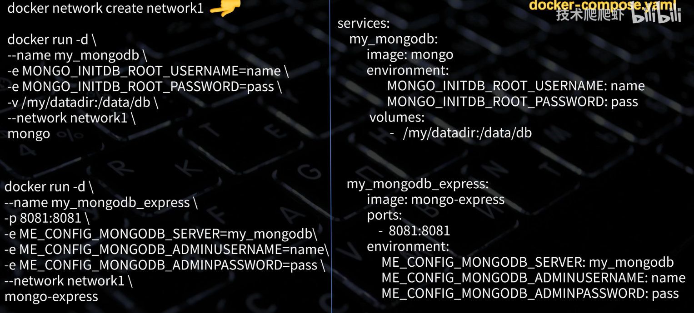

---
title: Docker容器
published: 2025-10-23
description: Docker容器轻易部署你的诸多项目。
image: ''
tags: ['docker', 'code']
category: 代码日常
draft: false
lang: zh-CN
---
    ## 基本命令
```shell
# 常用命令:

# 拉取镜像
docker pull php:7.2.34-zts-alpine3.12

# 设置容器名并运行容器
docker run -d --name php php:7.2.34-zts-alpine3.12

# 删除容器
docker rm -f $(docker ps -aq)
```


## Dockerfile

pass
## dockercompose

```yaml
version: '3.8'  # 推荐使用 3.8（兼容性好）

services:  # 定义所有容器服务
  service1:  # 服务名称（自定义）
    image: nginx:alpine  # 使用官方镜像
    container_name: my_nginx  # 自定义容器名（可选）
    ports:
      - "80:80"
    volumes:
      - ./nginx.conf:/etc/nginx/nginx.conf
    depends_on:
      - php
    networks:
      - app-network

  mysql:
    image: mysql:8.0
    volumes:
      - db-data:/var/lib/mysql  # 显式挂载命名卷
volumes:
  db-data:  # 声明命名卷

networks:  # 定义网络
  app-network:
    driver: bridge
```

通过compose启动的容器自动创建子网。

