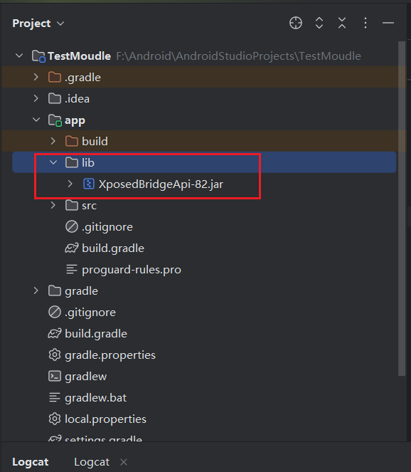
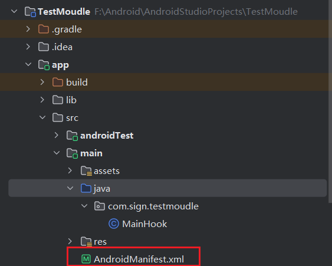
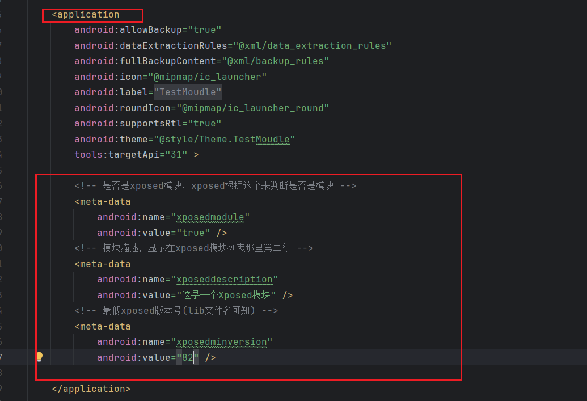
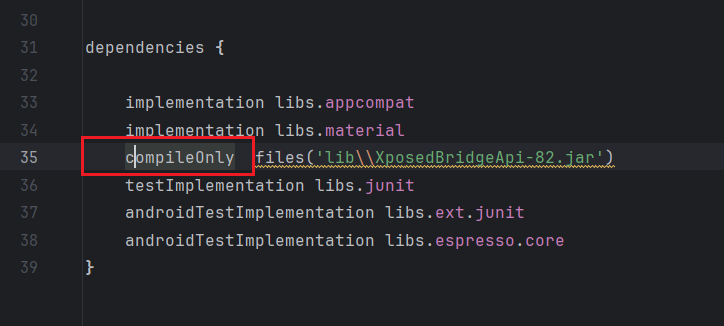
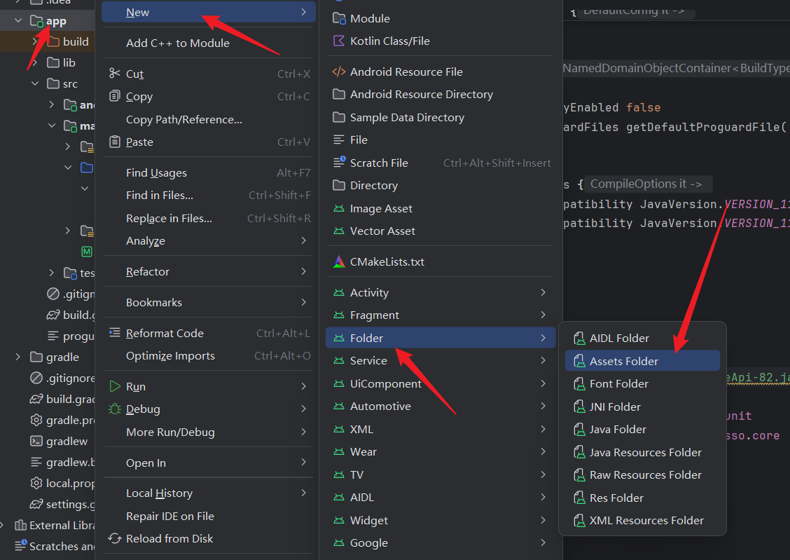
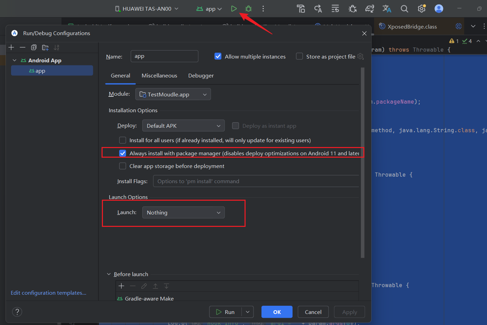
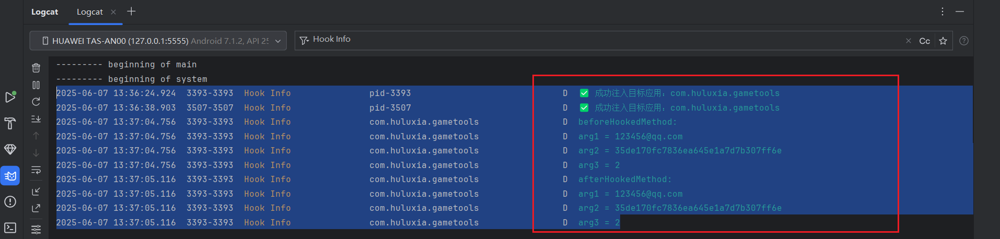

---
title: Xposed模块开发
published: 2025-10-23
description: Xposed是安卓Hook利器。
image: ''
tags: ['code', 'Xposed', 'hook']
category: 代码日常
draft: false
lang: zh-CN
---
    
## 开发条件

1. Xposed模块开发Api
2. Android Studio
3. Jadx

## 教学
> 在Android Studio 创建项目 选择No Activity. 然后等待项目构建完毕.

将下载的 xposedBridgeApi.jar 包拖进libs文件夹
(没有libs可自己创建)，右击jar包，选择add as library




然后修改xml文件配置



然后在application里面添加模块信息

```
<!-- 是否是xposed模块，xposed根据这个来判断是否是模块 -->
<meta-data
    android:name="xposedmodule"
    android:value="true" />
<!-- 模块描述，显示在xposed模块列表那里第二行 -->
<meta-data
    android:name="xposeddescription"
    android:value="这是一个Xposed模块" />
<!-- 最低xposed版本号(lib文件名可知) -->
<meta-data
    android:name="xposedminversion"
    android:value="89" />
```



找到app目录下的build.gradle,将此处修改为compileOnly 默认的是implementation


```
implementation 使用该方式依赖的库将会参与编译和打包
compileOnly 只在编译时有效，不会参与打包
```

新建-->Folder-->Assets Folder，创建xposed_init(不要后缀名):只有一行代码，就是说明入口类,这个入口类的类名必须和接下来新创建的java类相同.



新建Hook类，实现IXposedHookLoadPackage接口，然后在handleLoadPackage函数内编写Hook逻辑

基础代码

```
import android.util.Log;  
import de.robv.android.xposed.IXposedHookLoadPackage;  
import de.robv.android.xposed.XC_MethodHook;  
import de.robv.android.xposed.XposedHelpers;  
import de.robv.android.xposed.callbacks.XC_LoadPackage;  
  
public class MainHook implements IXposedHookLoadPackage {  
    public void handleLoadPackage(XC_LoadPackage.LoadPackageParam loadPackageParam) throws Throwable {  
        // 包名  
        String packgeName = "com.ss";  
  
        // 类名  
        String cls = "com.AccountModule";  
  
        // 方法名  
        String method = "d";  
  
        if (loadPackageParam.packageName.equals(packgeName)) {  
  
            Log.d("Hook Info", "✅ 成功注入目标应用：" + loadPackageParam.packageName);  
  
            // 注意类型  
            XposedHelpers.findAndHookMethod(cls, loadPackageParam.classLoader, method, java.lang.String.class, java.lang.String.class, int.class, new XC_MethodHook() {  
                @Override  
                // 方法执行前的操作  
                protected void beforeHookedMethod(MethodHookParam param) throws Throwable {  
                    super.beforeHookedMethod(param);  
                    // 打印参数（在方法执行前）  
                    Log.d("Hook Info", "beforeHookedMethod:");  
                    Log.d("Hook Info", "arg1 = " + param.args[0]);  
                    Log.d("Hook Info", "arg2 = " + param.args[1]);  
                    Log.d("Hook Info", "arg3 = " + param.args[2]);  
                }  
                @Override  
                // 方法执行后的操作  
                protected void afterHookedMethod(MethodHookParam param) throws Throwable {  
                    super.afterHookedMethod(param);  
                    // 打印参数（在方法执行后）  
                    Log.d("Hook Info", "afterHookedMethod:");  
                    Log.d("Hook Info", "arg1 = " + param.args[0]);  
                    Log.d("Hook Info", "arg2 = " + param.args[1]);  
                    Log.d("Hook Info", "arg3 = " + param.args[2]);  
                }  
            });  
        }  
    }  
}
```

然后调试代码运行看看



Hook成功!



[参考资料]("https://www.52pojie.cn/thread-1740944-1-1.html")


## 常用API

#### Hook变量

静态变量与实例变量：

- 静态变量（static）：类被初始化，同步进行初始化
- 非静态变量：类被实例化（产生一个对象的时候），进行初始化

静态变量

```
final Class clazz = XposedHelpers.findClass("类名", classLoader); 
XposedHelpers.setStaticIntField(clazz, "变量名", 999);
```

实例变量

```
final Class clazz = XposedHelpers.findClass("类名", classLoader);  
XposedBridge.hookAllConstructors(clazz, new XC_MethodHook() {  
     @Override
    protected void afterHookedMethod(MethodHookParam param) throws Throwable {  
        super.afterHookedMethod(param);  
        //param.thisObject获取当前所属的对象
        Object ob = param.thisObject;  
        XposedHelpers.setIntField(ob,"变量名",9999);  
    }  
});
```

#### Hook构造函数

无参数构造函数

```
XposedHelpers.findAndHookConstructor("com.zj.wuaipojie.Demo", classLoader, new XC_MethodHook() {
    @Override
    protected void beforeHookedMethod(MethodHookParam param) throws Throwable {
        super.beforeHookedMethod(param);
    }
    @Override
    protected void afterHookedMethod(MethodHookParam param) throws Throwable {
        super.afterHookedMethod(param);
    }
});
```

有参数构造函数

```
XposedHelpers.findAndHookConstructor("com.zj.wuaipojie.Demo", classLoader, String.class, new XC_MethodHook() {
    @Override
    protected void beforeHookedMethod(MethodHookParam param) throws Throwable {
        super.beforeHookedMethod(param);
    }
    @Override
    protected void afterHookedMethod(MethodHookParam param) throws Throwable {
        super.afterHookedMethod(param);
    }
});
```

#### 主动调用

静态方法

```
Class clazz = XposedHelpers.findClass("类名",lpparam.classLoader);
XposedHelpers.callStaticMethod(clazz,"方法名",参数(非必须));
```

实例方法

```
Class clazz = XposedHelpers.findClass("类名",lpparam.classLoader);
XposedHelpers.callMethod(clazz.newInstance(),"方法名",参数(非必须));
```

#### Hook内部类

```
XposedHelpers.findAndHookMethod("com.zj.wuaipojie.Demo$InnerClass", lpparam.classLoader, "innerFunc",String.class,  new XC_MethodHook() {  
    @Override  
    protected void beforeHookedMethod(MethodHookParam param) throws Throwable {  
        super.beforeHookedMethod(param);  

    }  
});
```

#### 其余用法

字符串赋值定位

```
XposedHelpers.findAndHookMethod("android.widget.TextView", lpparam.classLoader, "setText", CharSequence.class, new XC_MethodHook() {  
    @Override  
    protected void beforeHookedMethod(MethodHookParam param) throws Throwable {  
        super.beforeHookedMethod(param);  
        Log.d("zj2595",param.args[0].toString());  
                if(param.args[0].equals("已过期")){  
                    printStackTrace();  
                }
    }  
});
private static void printStackTrace() {  
    Throwable ex = new Throwable();  
    StackTraceElement[] stackElements = ex.getStackTrace();  
    for (int i = 0; i < stackElements.length; i++) {  
        StackTraceElement element = stackElements[i];  
        Log.d("zj2595","at " + element.getClassName() + "." + element.getMethodName() + "(" + element.getFileName() + ":" + element.getLineNumber() + ")");  
    }  
}
```
