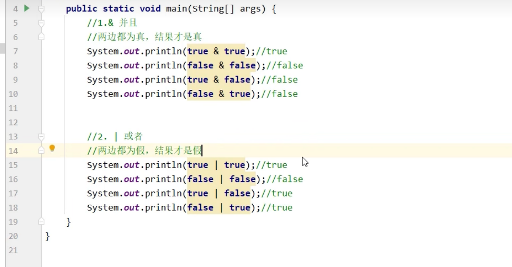
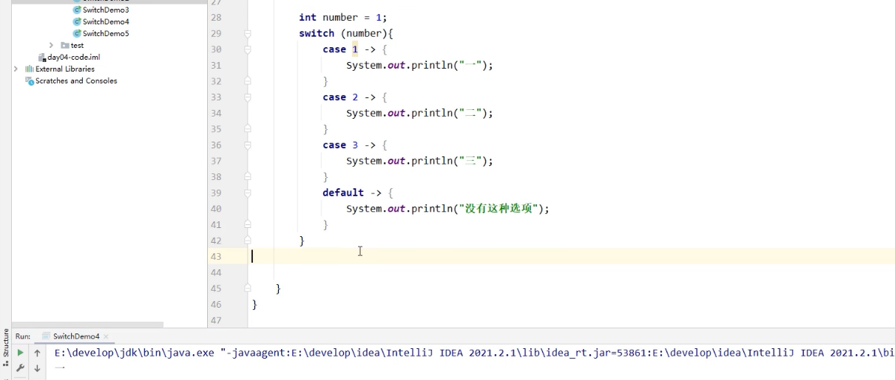

---
title: Java
published: 2025-10-23
description: 来杯咖啡。
image: ''
tags: ['code', 'java']
category: 代码日常
draft: false
lang: zh-CN
---
    ### JDK/JRE/JVM

JVM: java虚拟机，可以运行由 `javac` 转换的class二进制文件，相当于代码解释器。
JRE: java程序的运行需要java虚拟机与java库，它们的合集便是JRE，也便是java运行环境。
JDK包含着JVM和JRE同时也包含着开发工具 `javac`等。

综上所述：JDK > JRE > JVM


### 项目的目录

项目(project) > 模块(module) > 包(package) > 类(class)


### 逻辑运算符

`&`为单个的时候表示 "且"，当两边都为 `true`才为 `true`
`|`为单个的时候表示 "或"，当两边都为 `false`才为 `false`

> 单个的时候左右两边的命令都会执行



#### 短路操作

当出现两个的时候会出现**短路操作**，当左边的已经确定最终结果，那么右边就**不会参与运行。**

`&&`:当左边为false，那么右边不参与运行。
`||`:当左边为true，那么右边不参与运行。


### 循环

#### switch

```java
switch(name) {
case "jack":
	System.out.println("jack");
	break;
case "rose":
	System.out.println("rose");
	break;
	
case "iu", "ko":
	System.out.println("rose");
	break;
default:
	System.out.println("ikun"); // 当上面的条件都不匹配的时候执行
	break;
}
```


##### case穿透

当case语句匹配到了但是代码块中没有给break跳出，会**导致整个switch一直往下面运行。**


可以通过简化写法(自动补上了break)

```java
int num = 1;
switch(num) {
	case 1 -> {
		//pass
	}
	case 2 -> {
		// pass
	}
	default -> {
		//pass
	}
}

// 上面的代码还可以省略掉 {}
switch(num) {
	case 1 -> // pass
	case 2 -> // pass
	default -> // pass
}

```


### 隐式转换与强制转换
#### 隐式转换

在java中例如当int类型与long相加（较小类型与较大类型），int会隐式转换为long类型（小的自动转换为大的类型），然后再相加，结果为其中最大的那个类型，这便是隐式转换。


#### 强制转换
当类型大的要转换到类型小的时，需要强制转换（要注意可能会有问题）。需要添加 `byte b3 = (目标类型)(b1 + b2)` 类似于这种。

```java
byte b1 = 13;
byte b2 = 12;
byte b3 = (byte)(b1 + b2) // 30
```


#### 字符串与字符
字符 + 数字：字符会先转换为对应的Unicode码点（类似于ASCII码，但范围更广），然后与数字进行算术加法。

字符串+数字：数字会被转换为字符串，然后进行字符串拼接。

### Scanner用户交互

Scanner可以读取终端传入的内容，以便执行代码逻辑。

```java
import java.util.Scanner;
public class Main {
	public static void main (String[] args){
		// 创建实例
		Scanner sc = new Scanner(System.in);
		
		System.out.println("输入number1");
		int number1 = sc.nextInt();
		System.out.println("输入number2");
		int number2 = sc.nextInt();
		System.out.println(number1 + number2);

	}
}
```


### 数组

```java
//静态初始化
// 完整定义数组
int[] array = new int[] {1, 2, 3};
// 简化定义
int[] array = {1, 2, 3};

// ------------
// 动态初始化
int[] array = new int[5]; // 创建长度为5个元素的数组
```


### Java内存

堆：存储对象或数组，new创建的都放在堆内存。
栈：方法运行时使用的内存，例如main方法，进入方法栈执行。


