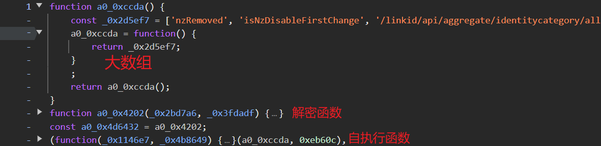
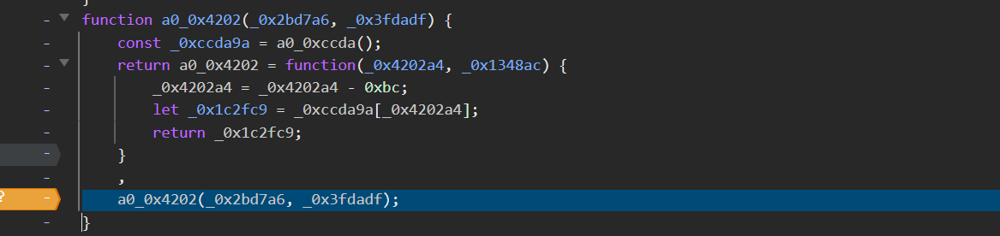

---
title: OB混淆
published: 2025-10-23
description: ''
image: ''
tags: ['hook', 'js', 'code']
category: 代码日常
draft: false
lang: zh-CN
---
    关于ob的总体大致为（大数组、解密函数、自执行函数），其中解密函数中的最后一段会对应大数组的参数，例如(encrypt)，面对ob混淆，可以先在解密函数中使用条件断点。

