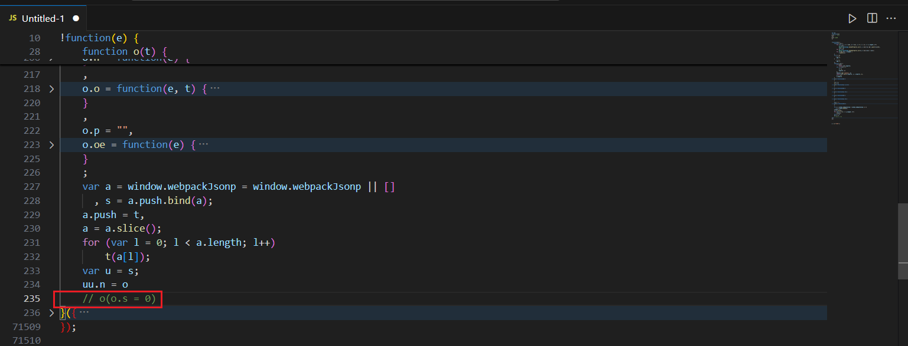

---
title: webpack扣代码
published: 2025-10-23
description: 快速webpack扣代码
image: ''
tags: ['code', 'webpack', 'js']
category: 代码日常
draft: false
lang: zh-CN
---
    webpack格式本身是一个自执行函数，后面的实参是模块。
```js
!function(e){
    // 加载器
}([
    //模块
])
```

> 在扣取网页的加载器代码中，要注意加载器后面网站是否调用了环境检测相关代码，例如在代码块中调用了n("env")等等。




## 自动化扣代码
#### 方法一:
首先把全部代码扣下然后运行，查看用到的模块，然后加载器的call之前添加代码`console.log(`"${t}":`,e[t].toString() + ',')` 运行后自动输出需要的依赖。

#### 方法二:
先找到加载器文件，然后替换文件，输入下面的代码。

在web页面加载器的上方定义一个code空字符串变量用于存储模块代码。然后在加载器的开头进行判断，判断这个`window.sw`是否为真，这个就相当于开关。
然后在执行模块调用的时候断点，刷新网站，此时还没有执行加载器的内部逻辑代码，code也没有东西，这个时候开启开关，然后手动控制台输入模块代码，执行后code就有值了。然后复制code的值就可以了。
```js
if (window.sw){
	code = code + `'${e}': ${u[e]},` +'\n'
}

kt.code = kt.code + '"' + a + '"' + ": " + e[a] + ',\n'
```