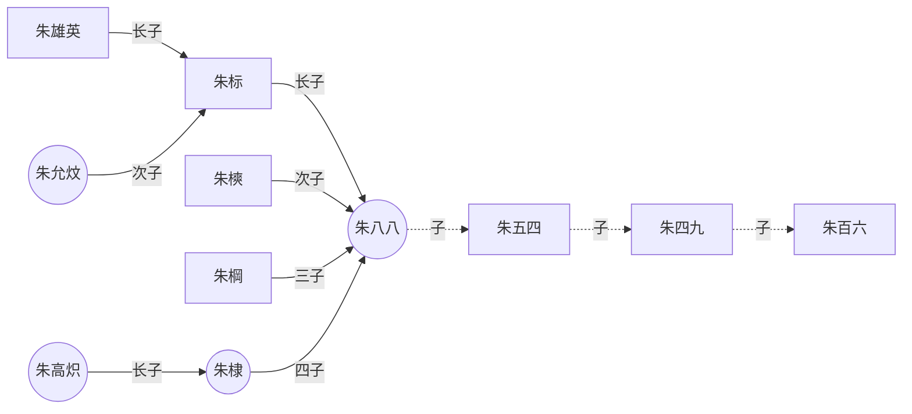
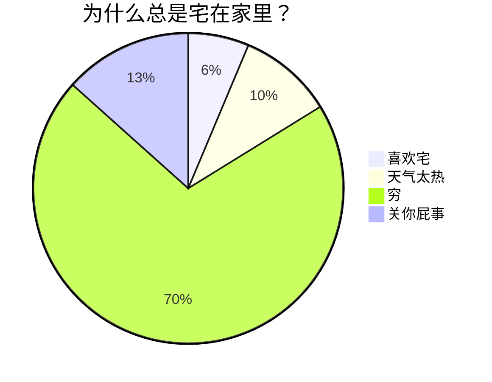

---
title: Markdown语法记录
published: 2025-10-23
description: ''
image: ''
tags: ['markdown', 'code']
category: 代码日常
draft: false
lang: zh-CN
---
    ## 目录
- [标题](#标题)
- [格式](#格式)
- [转义](#转义)
- [字体](#字体)
- [列表](#列表)
- [引用块](#引用块)
- [代码](#代码)
- [链接](#链接)
- [图片](#图片)

## 标题

标题的大小取决于前面的**＃号加空格**，例如(# 标题1) 在markdown代表一级标题，两个 # 就代表二级标题。

语法:
`### 三级标题`
`##### 五级标题`

---

## 格式

**段落的换行是使用两个以上空格加上回车**。一般情况下例如写完标题了，然后空格换行，再写段落，也就是段落与标题有一行的**行距**。

---

## 转义

转义就直接在语法前面加 `\` 就好了，要不然页面上不想被解析的也会被解析。例如想要打出 `#` 不想被解析成标题。也可以加两个反引号 ```
`` ``` ，不过加反引号就会变成代码类型了。通过`\`在前后，又或者是三个也可以输出特殊字符（三个用来打出两个反引号）

---

## 字体

粗体的话就直接两个 \* 包着文字，例如 \**文字\** ，斜体就两个 \* ，粗斜体就三个 \* 。

- *斜体*
- **粗体**
- ***粗斜体***

#### 删除线

左右各两个波浪线即可实现删除线的效果。

`~~内容~~`

~~内容~~

---

## 列表

列表的话分为有序与无序，还有一种复选框列表。无序列表只需要在段落前面加 \- 就好了。复选框列表例如：
` - [ ] 任务1`

在列表中的换行显示需要与列表项对齐。

#### 无序列表

```
- a
- b
- c
```

- a
- b
- c

#### 有序列表

```
1. apple
2. 水果
3. 火锅
```

1. apple
2. 水果
3. 火锅

#### 嵌套使用
>子列表需要缩进 2-4 个空格（推荐 2 个）

```
- 水果
  - 苹果
    - 红苹果
    - 绿苹果
  - 香蕉
  - 橙子
- 蔬菜
  - 胡萝卜
  - 白菜
```
- 水果
  - 苹果
    - 红苹果
    - 绿苹果
  - 香蕉
  - 橙子
- 蔬菜
  - 胡萝卜
  - 白菜

#### 复选框列表

```
- [ ] 待办任务列表1
- [ ] 待办任务列表2
- [x] 已办任务列表1    <!-- 英文字母X -->
- [x] 已办任务列表2
```

- [ ] 待办任务列表1
- [ ] 待办任务列表2
- [x] 已办任务列表1    <!-- 英文字母X -->
- [x] 已办任务列表2

---

## 引用块

引用块用于**突出显示重要信息、引用他人观点或创建视觉层次**。

语法：`> 内容`

当引用1使用了语法，那么引用2和引用3就不需要再加 > 。

代码段:
```
> 引用1
引用2
引用3
```

效果:

> 引用1
引用2
引用3

---
代码段:

```
> **用户反馈**：这个功能很有用！
> 
> > **开发团队回复**：感谢您的反馈，我们会继续优化。
> > 
> > > **项目经理补充**：预计下个版本会有更多改进。
```

效果:

> **用户反馈**：这个功能很有用！
> 
> > **开发团队回复**：感谢您的反馈，我们会继续优化。
> > 
> > > **项目经理补充**：预计下个版本会有更多改进。

---

## 代码

如果是段落上的一个函数或片段的代码可以用反引号把它包起来 \` 
例如：
`print(1)`

#### 代码区块

代码区块使用**4 个空格**或者一个**制表符（Tab 键）**。也可以使用三个反引号指定代码语言（也可以不指定）。

#### 语言标识和语法高亮

在三反引号后添加语言标识符可以启用语法高亮功能。

#### diff代码差异对比

用于显示代码的添加、删除或修改，常用于展示版本控制中的变更。

````
```diff
function calculateTotal(items) {
-   let total = 0;
+   let total = 0.0;
    
    for (let item of items) {
-       total += item.price;
+       total += parseFloat(item.price);
    }
    
+   // 保留两位小数
+   total = Math.round(total * 100) / 100;
    return total;
}
```
````

效果：

```diff
function calculateTotal(items) {
-   let total = 0;
+   let total = 0.0;
    
    for (let item of items) {
-       total += item.price;
+       total += parseFloat(item.price);
    }
    
+   // 保留两位小数
+   total = Math.round(total * 100) / 100;
    return total;
}
```

## 链接

```
[链接名称](链接地址)
[链接文字](链接地址 "可选的标题")
or
<链接地址>
```

#### 设置链接标题

作用:
- 当鼠标悬停在链接上时显示提示信息
- 对搜索引擎优化和无障碍访问有帮助
- 标题文字放在双引号、单引号或括号中都可以

示例:

  `[百度搜索](https://www.baidu.com "百度一下，你就知道")`
  
   效果:
  [百度搜索](https://www.baidu.com "百度一下，你就知道")

#### 设置参考链接

```这个链接用 1 作为网址变量 [Google][1]
这个链接用 2 作为网址变量 [baidu][2]
然后在文档的结尾为变量赋值（网址）

  [1]: http://www.google.com/
  [2]: http://www.baidu.com/
```

效果:
这个链接用 1 作为网址变量 [Google][1]
这个链接用 2 作为网址变量 [baidu][2]
然后在文档的结尾为变量赋值（网址）

  [1]: http://www.google.com/
  [2]: http://www.baidu.com/
  
当参考标签与链接文字相同时，可以省略第二个方括号：

```
我喜欢使用 [GitHub][] 来管理代码。

[GitHub]: https://github.com

```

效果:
我喜欢使用 [GitHub][] 来管理代码。

[GitHub]: https://github.com

#### 锚点链接的使用

锚点链接用于在同一文档内跳转，特别适合长文档的导航，前面是别名，后面是文档定位标题名：

```
## 目录
- [第一章：介绍](#第一章介绍)
- [第二章：安装](#第二章安装)
- [第三章：使用方法](#第三章使用方法)

# 第一章：介绍
这里是介绍内容...

# 第二章：安装
这里是安装说明...

# 第三章：使用方法
这里是使用说明...
```

---

## 图片

格式为:

```


```

Alt 文本（替代文字）在图片无法显示时提供替代信息，同时对无障碍访问和 SEO 很重要：

```


```

#### 图片链接组合
```
[](链接URL)
```

#### 流程图

````

````


#### 饼图
````

````


